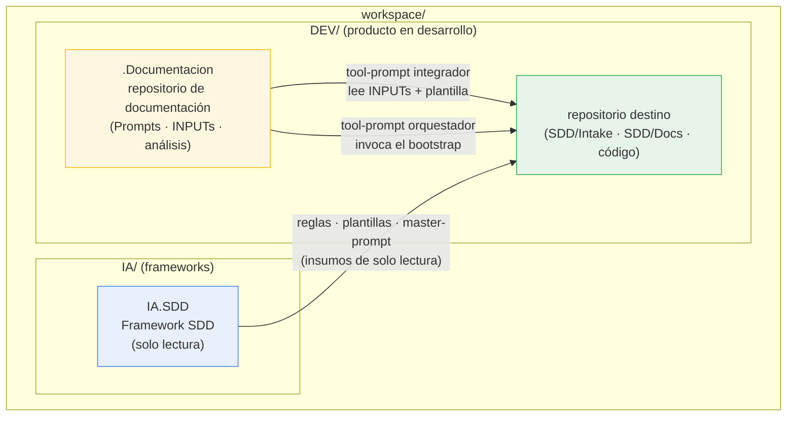
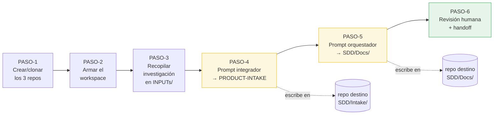
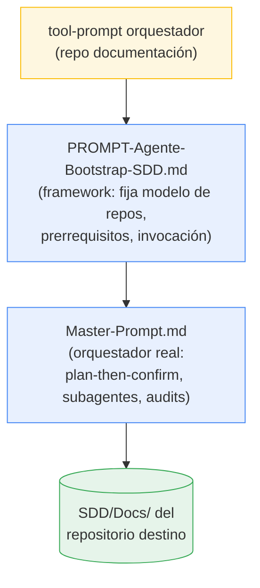

# SDD Getting Started Guide

```yaml
Documento: SDD-Getting-Started-Guide.md
Versión: 1.5
Fecha: 2026-07-29
Audiencia: desarrolladores que arrancan por primera vez un producto con el Framework SDD
Idioma: español rioplatense neutro técnico
Estado: vigente
```

> Esta es la guía de arranque del `Framework SDD` (Spec-Driven Development, desarrollo guiado por la especificación). Te lleva de la mano, la primera vez, desde el repositorio vacío hasta la documentación de especificación generada y auditada, lista para codear.
>
> No reemplaza a la [Guía de usuario](SDD-User-Guide.md): la resume para el primer contacto y le suma la mejora metodológica del último proceso experimentado (el repositorio de documentación con tool-prompts reejecutables).

---

## Resumen ejecutivo

**Qué es.** Un recorrido mínimo y ordenado para producir, por primera vez, la documentación de especificación SDD de un producto nuevo usando Claude Code sobre tus repositorios locales.

**Para qué sirve.** Para que un desarrollador que nunca usó SDD llegue de punta a punta —de la idea a la documentación auditada— sin tener que leer antes la guía de usuario completa ni el master-prompt.

**A quién le sirve.** A quien arranca un producto nuevo con SDD; y, como toda documentación del framework, también a los agentes de IA que ejecutan o verifican el proceso (ver frontmatter máquina-legible y los bloques `entradas`/`salidas`).

**Qué vas a tener al final.** Una carpeta `SDD/Docs/` poblada por categoría en el repositorio destino, un informe de audit por fase, un README raíz consolidado y un Sprint 1 listo para arrancar codificación, con el handoff a codificación explícito y confirmado por vos.

**En una frase.** SDD invierte el orden habitual: primero se especifica (intake → documentación por fases con audits), después se codea; y esta guía te muestra el camino corto para hacerlo la primera vez.

> Las afirmaciones sobre el flujo, las fases y los artefactos de esta guía están respaldadas por la [Guía de usuario](SDD-User-Guide.md) y por el [prompt de entrada Bootstrap](../../PROMPTS/PROMPT-Agente-Bootstrap-SDD.md). Los detalles del ejemplo aplicado están respaldados por los tool-prompts reales del producto `<Slug-Producto>` (ver §6).

---

## Tabla de contenido

- [§1 Qué vas a lograr y qué asume esta guía](#1-qué-vas-a-lograr-y-qué-asume-esta-guía)
- [§2 El modelo de tres repositorios](#2-el-modelo-de-tres-repositorios)
- [§3 Prerrequisitos verificables](#3-prerrequisitos-verificables)
- [§4 El flujo de principio a fin (6 pasos)](#4-el-flujo-de-principio-a-fin-6-pasos)
  - [PASO-1 — Crear y clonar los tres repositorios](#paso-1--crear-y-clonar-los-tres-repositorios)
  - [PASO-2 — Armar la jerarquía del workspace](#paso-2--armar-la-jerarquía-del-workspace)
  - [PASO-3 — Recopilar la investigación en INPUTs](#paso-3--recopilar-la-investigación-en-inputs)
  - [PASO-4 — Ejecutar el prompt integrador (genera el intake)](#paso-4--ejecutar-el-prompt-integrador-genera-el-intake)
  - [PASO-5 — Ejecutar el prompt orquestador (genera la documentación)](#paso-5--ejecutar-el-prompt-orquestador-genera-la-documentación)
  - [PASO-6 — Revisión humana y handoff a codificación](#paso-6--revisión-humana-y-handoff-a-codificación)
- [§5 La mejora metodológica: repositorio de documentación y tool-prompts](#5-la-mejora-metodológica-repositorio-de-documentación-y-tool-prompts)
- [§6 Ejemplo aplicado end-to-end](#6-ejemplo-aplicado-end-to-end)
- [§7 Errores frecuentes de arranque](#7-errores-frecuentes-de-arranque)
- [§8 Próximos pasos y referencias](#8-próximos-pasos-y-referencias)
- [§9 Glosario mínimo de arranque](#9-glosario-mínimo-de-arranque)
- [Control de cambios](#control-de-cambios)

---

## §1 Qué vas a lograr y qué asume esta guía

Al terminar esta guía vas a haber ejecutado el flujo completo de especificación de un producto nuevo: desde recopilar el material de investigación hasta autorizar el handoff a codificación con la documentación auditada.

Esta guía asume que:

- Es tu **primera** producto con SDD. Si ya trabajaste con el framework, andá directo a la [Guía de usuario](SDD-User-Guide.md) §9.2.
- Tu producto es **de un solo unidad de entrega** o **multi-proyecto**: el flujo es el mismo; las diferencias de layout las resuelve el orquestador (ver §4 PASO-5 y la [Guía de usuario](SDD-User-Guide.md) §5.4).
- Vas a trabajar **en local con Claude Code**, no solo en Claude.ai web.

Lo que esta guía **no** cubre (y dónde está):

| Necesitás | Andá a |
|---|---|
| La teoría (por qué plan-then-confirm, la cadena D6, invariantes D1-D9) | Marco teórico del template |
| El detalle de cada fase, FAQ extensa, casos por tipo D8 | [Guía de usuario](SDD-User-Guide.md) §4 a §10 |
| La mecánica interna del orquestador | [Master-Prompt.md](../Devs/Orchestrator/Master-Prompt.md) |
| Cómo se valida el intake y se deriva el manifiesto | [Intake-Rules.md](../Devs/Rules/Intake-Rules.md) |

---

## §2 El modelo de tres repositorios

SDD trabaja sobre repositorios **separados por responsabilidad**. La [Guía de usuario](SDD-User-Guide.md) §4.4 describe el modelo mínimo de **dos** repositorios (fuente + destino). El último proceso experimentado (§5) suma un tercero: un **repositorio de documentación** por producto, que persiste los tool-prompts y el material de investigación. Los tres son:

| Rol | Ejemplo | Escritura | Contiene |
|---|---|---|---|
| **Framework SDD** (fuente, solo lectura) | `IA.SDD` | Nunca lo tocás | Reglas, plantillas de intake, los dos master-prompts, guías, los dos prompts de entrada |
| **Repositorio destino** | `<Slug-Producto>` | Los orquestadores escriben acá | El intake (`SDD/Intake/`), la documentación generada (`SDD/Docs/`) y, más adelante, el código |
| **Repositorio de documentación** | `<Slug-Producto>.Documentacion` | Vos, a mano | Los tool-prompts reejecutables (`Prompts/`), el material de investigación (`INPUTs/`), indexación y análisis |

> **Definición — tool-prompt.** Un prompt operativo, versionado y reejecutable, que se invoca desde Claude Code con la fórmula «Lee y ejecuta `<ruta>`». Vive en el repositorio de documentación y dispara una tarea concreta sobre el repositorio destino (por ejemplo, «generar el intake» o «arrancar el orquestador»).

Diagrama del workspace y de quién escribe sobre quién:



Por qué esta separación:

- El **framework** queda intacto y sus mejoras se propagan a productos nuevos sin re-copiarlo (ver [Bootstrap §1](../../PROMPTS/PROMPT-Agente-Bootstrap-SDD.md)).
- El **destino** concentra los artefactos entregables (intake, documentación, código): es la única fuente de verdad del producto.
- La **documentación** conserva el «cómo se hizo»: los prompts que ejecutaste, con qué inputs, en qué orden. Eso hace el proceso **reproducible y auditable**, no una charla que se pierde.

> La posición relativa de los repositorios en el workspace es indistinta: el prompt de entrada deriva la ruta de la fuente de su propia invocación y la del destino de la cláusula «en el repositorio:» ([Bootstrap §1](../../PROMPTS/PROMPT-Agente-Bootstrap-SDD.md), v2.1). El ejemplo usa `IA/IA.SDD` y `DEV/<producto>`, pero podrían estar en cualquier lado.

---

## §3 Prerrequisitos verificables

Antes de arrancar, confirmá que tenés todo. Estos son los mínimos de la [Guía de usuario](SDD-User-Guide.md) §2, ajustados al arranque:

- **Claude Code** instalado y autenticado en tu máquina (es la CLI que ejecuta los prompts sobre tus repositorios).
- **Git** inicializado en cada repositorio (SDD trabaja sobre archivos versionados y asume commits intermedios entre fases).
- **Editor con vista previa de markdown** (Visual Studio Code, Cursor, Zed u otro), muy útil para revisar los entregables.
- **Una terminal funcional** (PowerShell 5.1+ o Git Bash/WSL en Windows; cualquier shell POSIX en Linux/macOS).

Conocimientos mínimos asumidos: markdown básico, Git básico (`clone`, `add`, `commit`), y terminología ágil de superficie (sprint, user story, definition of done). **No** necesitás experiencia previa con SDD ni saber escribir prompts: los tool-prompts ya vienen escritos.

Verificación rápida (bloque para agentes: son las precondiciones ejecutables del arranque):

```bash
git --version
claude --version
ls ~/.claude
```

Si los tres comandos responden, estás en condiciones de arrancar.

---

## §4 El flujo de principio a fin (6 pasos)

Estos son los seis pasos del arranque. Los tres primeros los hacés vos con Git y tu editor; los pasos 4 y 5 los ejecuta Claude Code leyendo un tool-prompt; el paso 6 es tu revisión humana antes del handoff.



### PASO-1 — Crear y clonar los tres repositorios

Poné los tres repositorios en un workspace común. El framework `IA.SDD` es de solo lectura; los otros dos son de tu producto.

```bash
# En la carpeta del workspace
# 1) Framework SDD (fuente, solo lectura)
git clone <url-de-IA.SDD> IA/IA.SDD

# 2) Repositorio destino del producto
git clone <url-del-destino> DEV/<Slug-Producto>

# 3) Repositorio de documentación del producto
git clone <url-de-documentacion> DEV/<Slug-Producto>.Documentacion
```

**Convención de nombres.** El repositorio de documentación lleva el nombre del producto con el sufijo `.Documentacion` (por ejemplo `<Slug-Producto>` → `<Slug-Producto>.Documentacion`). El destino normalmente lleva el nombre del producto tal cual.

> Si tu producto es de un solo unidad de entrega, igual usás los tres repos: el modelo no cambia. Lo que cambia según sea de uno o varias unidades de entrega es cómo el orquestador organiza `SDD/Docs/`, no cómo arrancás.

### PASO-2 — Armar la jerarquía del workspace

Agrupá los repositorios por naturaleza. Una convención que funciona: una carpeta `DEV/` para los repositorios del producto en desarrollo y una carpeta `IA/` para los frameworks de IA.

```text
workspace/
├── DEV/                                  # repositorios del producto en desarrollo
│   ├── <Slug-Producto>/                 # repositorio destino
│   │   └── SDD/                          # (lo genera el flujo: Intake/, Docs/)
│   └── <Slug-Producto>.Documentacion/   # repositorio de documentación
│       └── Prompts/
│           ├── 01-Ejecutar-Prompt-Integrador-Documento-Intake/
│           │   ├── Ejecutar-Prompt-Integrador-Documento-Intake.md   # tool-prompt
│           │   └── INPUTs/               # tu material de investigación
│           └── 02-Ejecutar-Prompt-Orquestador/
│               └── Ejecutar-Prompt-Orquestador.md                   # tool-prompt
└── IA/                                   # frameworks de IA
    └── IA.SDD/                           # Framework SDD (fuente, solo lectura)
        ├── PROMPTS/PROMPT-Agente-Bootstrap-SDD.md
        └── SDD/
            ├── Devs/  (Rules, Intake, Orchestrator, References, …)
            └── Guides/  (esta guía y la Guía de usuario)
```

Los nombres de las carpetas agrupadoras (`DEV/`, `IA/`) son convención, no requisito: podés usar otros. Lo que importa es que los tres repositorios sean accesibles desde el mismo workspace.

### PASO-3 — Recopilar la investigación en INPUTs

Antes de generar nada, juntá el material que describe el producto que querés construir: análisis, requerimientos funcionales, topología de proyectos de código, definición de stack, notas del cliente, ejemplos. Dejá todo eso como documentos en la carpeta de inputs del tool-prompt integrador, en el **repositorio de documentación**:

```text
<RUTA-DOCUMENTACION>/Prompts/01-Ejecutar-Prompt-Integrador-Documento-Intake/INPUTs/
```

**Regla de oro de este paso:** el intake se genera a partir de estos inputs. Si un dato bloqueante no está acá (ni en el cuerpo del tool-prompt), el proceso se va a detener más adelante para pedírtelo. Cuanto más completo el material, menos idas y vueltas.

> Este paso reemplaza —o complementa— al chat informal en Claude.ai web de la [Guía de usuario](SDD-User-Guide.md) §4.1–§4.2. Ambos caminos convergen en el mismo artefacto (el intake); la diferencia es que acá el material queda **persistido y versionado** en el repo de documentación. Ver §5.

### PASO-4 — Ejecutar el prompt integrador (genera el intake)

Este paso corresponde al **Paso 4 del último proceso experimentado**: se invoca un **prompt integrador** que toma todo el material de investigación y lo reúne en un único documento de entrada, el intake.

Abrí Claude Code con el workspace en contexto e invocá el tool-prompt integrador:

```text
Lee y ejecuta <RUTA-DOCUMENTACION>/Prompts/01-Ejecutar-Prompt-Integrador-Documento-Intake/Ejecutar-Prompt-Integrador-Documento-Intake.md
```

Bloque para agentes — qué hace este tool-prompt:

- **Entradas:** el material de `INPUTs/`, la plantilla oficial [`PRODUCT-INTAKE-template.md`](../Devs/Intake/PRODUCT-INTAKE-template.md), el stack y los datos del producto declarados en el cuerpo del propio tool-prompt.
- **Proceso:** crea en el **repositorio destino** la jerarquía de carpetas que pide el framework y vuelca el material a la plantilla de intake, respetando sus tres partes: A negocio (§1–§12), B composición con la tabla de unidades de entrega (§13–§16) y C técnica por unidad de entrega (§17). Marca como `PENDIENTE` lo que falte, en lugar de inventar.
- **Salidas:** un único archivo `SDD/Intake/PRODUCT-INTAKE-<Nombre-Producto>.md` en el repositorio destino, con el checklist de §19 apuntando a completitud.

> **No** completás el `PRODUCT-MANIFEST` a mano: lo deriva el orquestador de la §13 del intake en el paso siguiente ([Guía de usuario](SDD-User-Guide.md) §4.3, F-19).

Si el integrador deja `PENDIENTE`s, resolvelos (completá el input que falta o respondé la pregunta) y volvé a ejecutarlo hasta que el intake quede íntegro. **No avances al PASO-5 con el intake incompleto.**

### PASO-5 — Ejecutar el prompt orquestador (genera la documentación)

Este paso corresponde al **Paso 5 del último proceso experimentado**: se invoca el **prompt orquestador**, que arranca la generación de toda la documentación de especificación a partir del intake.

Invocá el tool-prompt orquestador desde Claude Code:

```text
Lee y ejecuta <RUTA-DOCUMENTACION>/Prompts/02-Ejecutar-Prompt-Orquestador/Ejecutar-Prompt-Orquestador.md
```

Ese tool-prompt es una fina capa que delega en el **prompt de entrada Bootstrap** del framework, que a su vez delega en el **master-prompt** (el orquestador real):



Qué pasa a partir de acá (resumen; el detalle está en la [Guía de usuario](SDD-User-Guide.md) §4.5):

1. **Fase de validación de intake.** El orquestador lee tu `PRODUCT-INTAKE`, valida su completitud, **deriva el `PRODUCT-MANIFEST`** de la §13 y te lo presenta para confirmación. Si falta algo bloqueante, se detiene y te hace una batería de preguntas en vez de avanzar a ciegas.
2. **Plan de generación.** Ordena las unidades de entrega en orden topológico y te muestra el plan (unidades de entrega, tipos, categorías a producir, flags). Lo revisás y respondés `aprobar` (o `aprobar con cambios: …`).
3. **Generación por fases (A a H), con plan-then-confirm.** Cada fase produce documentos y cierra con un **audit independiente**. Entre fases, el orquestador se detiene, te muestra el informe del audit y espera tu confirmación. Si un audit devuelve `RECHAZADO` por un hallazgo P0, no avanza hasta corregir.
4. **(Opcional) Fase B2 — validación visual de maqueta.** Solo en unidades de entrega con interfaz visual y si confirmás el flag `requiere_maqueta`. Materializa la especificación de UX/UI en una maqueta navegable. Ver [Guía de usuario](SDD-User-Guide.md) §4.6.

> **Confirmá cada fase con calma.** El patrón plan-then-confirm es la garantía de calidad del framework: el orquestador **no codea sin tu confirmación** y no salta fases. Tomarte el tiempo de leer cada audit es parte del método, no una demora.

### PASO-6 — Revisión humana y handoff a codificación

Cuando el orquestador termina la Fase H, te presenta el resumen ejecutivo. Antes de autorizar el paso a código, hacé una revisión humana rápida ([Guía de usuario](SDD-User-Guide.md) §4.7):

- **Trazabilidad:** abrí 3–4 user stories al azar y verificá que la cadena US → CU → NB → Visión cierra.
- **Completitud:** recorré las categorías de cada unidad de entrega y abrí su README. Si alguno está vacío, algo falló en la generación.
- **Coherencia:** leé la visión, los CU del Sprint 1 y el ADR-001. ¿Cuentan la misma historia?
- **Pendientes:** cerrá las decisiones pendientes o documentalas como riesgos asumidos.

Cuando todo cierra, autorizás el handoff:

```text
Confirmo handoff a codificación. Arrancamos Sprint 1 con los ítems
listados en el resumen ejecutivo.
```

A partir de ahí salís del alcance de SDD (que es documentación) y entrás al ciclo de desarrollo iterativo. La documentación queda como referencia viva: se actualiza cuando hay cambios reales.

> **Pregunta guía.** ¿Podés contar el producto entero leyendo solo el README raíz, la visión y los CU del Sprint 1? Si sí, el arranque salió bien. Si no, hay un hueco que conviene cerrar antes de codear.

---

## §5 La mejora metodológica: repositorio de documentación y tool-prompts

Esta sección documenta explícitamente **qué agrega el último proceso experimentado** respecto de lo que describe la [Guía de usuario](SDD-User-Guide.md), y por qué es una mejora.

**Lo que dice la guía de usuario (modelo base).** El pre-intake se hace conversando en Claude.ai web (§4.1), se consolida en un documento (§4.2) y se vuelca a la plantilla de intake (§4.3); el workspace es de **dos** repositorios: fuente (`IA.SDD`) y destino (§4.4).

**Lo que suma la experiencia última (refinamiento).** Un **tercer repositorio**, el de documentación (`<Producto>.Documentacion`), que persiste dos cosas que en el modelo base quedaban efímeras:

1. El **material de investigación** (`INPUTs/`), versionado en Git en vez de disperso en un chat.
2. Los **tool-prompts reejecutables** (`Prompts/01-…` integrador y `Prompts/02-…` orquestador), que fijan por escrito y de forma reproducible cómo se genera el intake y cómo se arranca el orquestador para *esta* producto.

Comparación de los dos caminos hacia el mismo intake:

| Aspecto | Modelo base (guía de usuario §4.1–§4.3) | Refinamiento (experiencia última) |
|---|---|---|
| Dónde vive el pre-intake | Chat en Claude.ai web | `INPUTs/` del repo de documentación |
| Cómo se genera el intake | Volcado manual asistido en el chat | Tool-prompt integrador ejecutado en Claude Code |
| Reproducibilidad | Baja (la charla se pierde) | Alta (prompt + inputs versionados) |
| Cómo se arranca el orquestador | Se pega/lee el prompt de entrada a mano | Tool-prompt orquestador que delega en el bootstrap |
| Repositorios en juego | 2 (fuente + destino) | 3 (+ documentación) |

**Por qué es una mejora.** Porque convierte el arranque en un proceso **auditable, versionado y repetible**: cualquiera puede volver a correr el integrador con los mismos inputs y obtener el mismo intake, y el «cómo se hizo» queda en el repositorio, no en la memoria de quien lo hizo. Es coherente con el invariante de **evidencia verificable** del framework: toda afirmación respaldada por un artefacto localizable y reproducible ([Guía de usuario](SDD-User-Guide.md) §10.1, D9).

**Qué se mantiene idéntico.** El artefacto de salida (el `PRODUCT-INTAKE` en `SDD/Intake/` del destino), el rol del framework como fuente de solo lectura, la derivación del manifiesto por el orquestador y todo el flujo de fases A–H con audits. El refinamiento **no** modifica el framework: es una forma de organizar el trabajo alrededor de él.

---

## §6 Ejemplo aplicado end-to-end

El recorrido de abajo es un caso real, con los nombres del producto reemplazados por `<Slug-Producto>` para preservar D7. Los tiempos, los conteos y la secuencia de pasos son los que efectivamente ocurrieron.

Caso real que ilustra el flujo completo. Los datos provienen del tool-prompt integrador del producto (`Ejecutar-Prompt-Integrador-Documento-Intake.md`), que es evidencia verificable del arranque.

**Contexto.** `<Slug-Producto>` es un servicio de monitoreo y gestión de un parque de dispositivos con un panel de control web. El material de investigación describe las prestaciones a partir de un documento de análisis unificado y una topología de proyecto/producto.

**Repositorios del caso:**

```text
DEV/
├── <Slug-Producto>/                 # destino: SDD/Intake, SDD/Docs, código
└── <Slug-Producto>.Documentacion/   # documentación: Prompts, INPUTs
IA/
└── IA.SDD/                           # framework (solo lectura)
```

**Stack declarado en el tool-prompt** (queda en la Parte C del intake): servicio web .NET 10, Blazor con render interactivo server, Entity Framework; librerías MudBlazor; base de datos SQLite; arquitectura del servicio **monolítica** (front, API REST y backend en un solo servicio).

**Jerarquía de usuarios:** un único usuario administrador; al iniciar, el sistema pide usuario y contraseña de administración.

**PASO-3 — inputs.** El material se dejó en `Prompts/01-Ejecutar-Prompt-Integrador-Documento-Intake/INPUTs/`: el análisis unificado de prestaciones, la topología de proyecto/producto y la definición del entorno de desarrollo.

**PASO-4 — integrador.** Se ejecutó el tool-prompt integrador, que construyó el intake en `<Slug-Producto>/SDD/Intake/` a partir de esos inputs y de la plantilla de intake, sin inventar datos.

**PASO-5 — orquestador y etapas de codificación previstas.** El tool-prompt integrador también dejó pautadas, para las fases posteriores de codificación, etapas con puntos de validación humana tangibles. Las primeras:

- **Etapa 1:** scaffolding del producto y scripts de run/build local; el producto compila y corre; validación visual de la estructura.
- **Etapa 2:** front con menú lateral y barra superior; validación visual en el navegador contra la maqueta de UX/UI.
- **Etapa 3:** integración de SQLite y entidades de autenticación/autorización; primera pantalla de alta del administrador.
- **Etapa 4:** login, cambio de contraseña y acciones de la barra superior (cerrar sesión, cambio de contraseña).

Las etapas siguientes se estructuran según los flujos de usuario previstos (UF-1 a UF-10: alta del parque de dispositivos, configuración de políticas, monitoreo en vivo, históricos y gráficas, prueba de estado y salud, atención de servicio técnico, reparación o sustitución de un dispositivo, ventana de mantenimiento, informe de período, ingesta automatizada), verificando en el navegador que las pantallas funcionan en cada una.

> Estas etapas pertenecen a la fase de **codificación**, posterior al handoff (PASO-6). Se citan acá porque muestran cómo el intake condiciona no solo la documentación sino el plan de sprints que el orquestador va a derivar, con puntos de validación tangibles en cada etapa.

---

## §7 Errores frecuentes de arranque

Checklist de los tropiezos más comunes la primera vez:

- **Escribir en el framework.** `IA.SDD` es de solo lectura. Si necesitás cambiar una regla, es un cambio de framework, no de tu producto. Nunca edites la fuente para un caso puntual.
- **Avanzar con el intake incompleto.** Si el integrador dejó `PENDIENTE`s, resolvelos antes del PASO-5. El intake incompleto es la principal fuente de documentación pobre; el orquestador se va a frenar igual.
- **Completar el `PRODUCT-MANIFEST` a mano.** No se hace: lo deriva el orquestador de la §13. Vos solo completás el `PRODUCT-INTAKE`.
- **`SDD/Docs/` con contenido previo.** Si el destino ya tiene documentación de una corrida anterior, el orquestador no arranca de una: ejecuta la reconciliación normativa ([Master-Prompt §2.1](../Devs/Orchestrator/Master-Prompt.md)). Lee con qué versión del framework se generó ese árbol, la compara con la vigente y te dice qué cambió y qué documentos quedaron potencialmente invalidados. Después te ofrece tres caminos: un plan de migración normativa documento por documento, regenerar todo desde cero, o seguir bajo la versión anterior. Hasta que elijas, no toca nada. Ejecutar el plan es una corrida aparte, con [`PROMPT-Agente-Migracion-SDD.md`](../../PROMPTS/PROMPT-Agente-Migracion-SDD.md), que lleva el destino a la versión vigente preservando su contenido.
- **Aprobar el plan sin leerlo.** Revisá tipos D8, unidad de entrega principal, orden topológico y flags (`usa_llm`, `tiene_auth`, `equipo_n`). Un flag mal puesto genera categorías de más o de menos.
- **Perder el material de investigación en un chat.** Dejalo en `INPUTs/` del repo de documentación. Es lo que hace el arranque reproducible (§5).
- **Un `tipo_unidad_entrega` fuera de D8.** Cada unidad de entrega declara exactamente uno de los 8 tipos cerrados. Cualquier otro valor es un error bloqueante.

Para el catálogo completo de resolución de problemas, ver [Guía de usuario](SDD-User-Guide.md) §6 (F-01 a F-29).

---

## §8 Próximos pasos y referencias

Cuando termines tu primer arranque:

1. Leé la [Guía de usuario](SDD-User-Guide.md) completa para dominar las fases, la regeneración parcial (§8) y la FAQ (§6).
2. Recorré la plantilla [`PRODUCT-INTAKE-template.md`](../Devs/Intake/PRODUCT-INTAKE-template.md) para entender qué campos alimentan cada categoría.
3. Si tu producto tiene interfaz visual, estudiá la Fase B2 de validación de maqueta ([Guía de usuario](SDD-User-Guide.md) §4.6).
4. Guardá tus tool-prompts en el repo de documentación como base para la próxima producto: ya tenés el molde.

Referencias de esta guía:

| Referencia | Ruta |
|---|---|
| Guía de usuario del template SDD | `/IA/IA.SDD/SDD/Guides/SDD-User-Guide.md` |
| Prompt de entrada Bootstrap | `/IA/IA.SDD/PROMPTS/PROMPT-Agente-Bootstrap-SDD.md` |
| Master-prompt (orquestador de generación) | `/IA/IA.SDD/SDD/Devs/Orchestrator/Master-Prompt.md` |
| Prompt de entrada Migración normativa | `/IA/IA.SDD/PROMPTS/PROMPT-Agente-Migracion-SDD.md` |
| Master-prompt (orquestador de migración) | `/IA/IA.SDD/SDD/Devs/Orchestrator/Master-Prompt-Migracion.md` |
| Plantilla de intake | `/IA/IA.SDD/SDD/Devs/Intake/PRODUCT-INTAKE-template.md` |
| Reglas de validación de intake | `/IA/IA.SDD/SDD/Devs/Rules/Intake-Rules.md` |
| Tool-prompt integrador (ejemplo) | `<RUTA-DOCUMENTACION>/Prompts/01-Ejecutar-Prompt-Integrador-Documento-Intake/Ejecutar-Prompt-Integrador-Documento-Intake.md` |
| Tool-prompt orquestador (ejemplo) | `<RUTA-DOCUMENTACION>/Prompts/02-Ejecutar-Prompt-Orquestador/Ejecutar-Prompt-Orquestador.md` |

---

## §9 Glosario mínimo de arranque

Solo los términos que necesitás para el primer arranque. El glosario completo está en la [Guía de usuario](SDD-User-Guide.md) §10.1.

| Término | Definición breve |
|---|---|
| Framework SDD | El template de solo lectura (`IA.SDD`): reglas, plantillas, los dos master-prompts, guías. No se toca por producto. |
| Repositorio destino | Repositorio del producto donde los orquestadores escriben el intake, la documentación (`SDD/Docs/`) y luego el código. |
| Repositorio de documentación | Repositorio `<Producto>.Documentacion` que persiste los tool-prompts (`Prompts/`) y el material de investigación (`INPUTs/`). Aporte de la experiencia última. |
| Tool-prompt | Prompt operativo, versionado y reejecutable, invocado con «Lee y ejecuta `<ruta>`», que dispara una tarea sobre el destino. |
| Intake (`PRODUCT-INTAKE`) | Documento único de entrada del producto. Fuente de verdad del negocio, la composición y la técnica. El único documento que completás. |
| Prompt integrador | Tool-prompt que reúne el material de `INPUTs/` en el intake, sobre la plantilla del framework. |
| Prompt orquestador | Tool-prompt que arranca la generación; delega en el bootstrap y este en el master-prompt. |
| `PRODUCT-MANIFEST` | Manifiesto derivado por el orquestador de la §13 del intake. No lo completás a mano. |
| Plan-then-confirm | Modo del orquestador: cada fase se planifica, se confirma con vos, se ejecuta, se audita y se detiene. |
| Audit independiente | Revisión de cierre de fase por un subagente sin contexto previo. Veredicto bloqueante (P0 detiene el avance). |
| Handoff a codificación | Punto en que el orquestador entrega la documentación auditada y espera tu confirmación para arrancar Sprint 1. |
| D8 | Conjunto cerrado de 8 tipos de unidad de entrega: `library`, `web-monolith`, `web-microservices`, `desktop-app`, `mobile-app-maui`, `rest-api`, `cli-tool`, `worker-service`. |
| Producto | Lo que entregás y que alguien usa para obtener valor, con frontera clara, stakeholders conocidos y roadmap propio. Es la unidad de trabajo: un intake, un repositorio destino, un árbol `SDD/Docs/`. |
| Proyecto de código | La unidad de compilación: lo que tu ecosistema llama *project*, *module* o *package*. Un producto puede tener uno o veinte. Lleva exactamente un tipo D8. |
| Proyecto | El emprendimiento, el esfuerzo temporal de construir el producto. **«Proyecto» a secas siempre significa esto**; la unidad de compilación se escribe completa, «proyecto de código». |
| Solución de código | El agrupador de construcción del ecosistema (el `.sln` de .NET, el POM agregador, el *workspace*). No se dice «solución» a secas. |
| Los cuatro nombres del producto | `Nombre-Producto` en prosa («Gestión de Turnos»), `Slug-Producto` para archivos (`Gestion-De-Turnos`, se deriva del anterior), `Raiz-Codigo` para el código (**la declarás vos**, admite segmentos: `Contoso.Turnos`) y `Artefacto-Agrupacion` (`Contoso.Turnos.sln`). Son independientes: si dos coinciden salvo por la puntuación, el orquestador se detiene. |
| Vocabulario normativo | La regla `Vocabulario-Rules.md`: qué designa cada término del framework y cuándo una palabra con más de un sentido hay que desambiguar. La leen el orquestador, todos los subagentes y todos los auditores. |

---

## Control de cambios

| Versión | Fecha | Cambios |
|---|---|---|
| 1.0 | 2026-07-24 | Creación de la guía de arranque. Recorrido de 6 pasos del arranque de una solución nueva con SDD, alineado con la Guía de usuario (§2 a §10) y con el prompt de entrada Bootstrap. Documenta la mejora metodológica del último proceso experimentado: el modelo de tres repositorios (framework, destino, documentación) y los tool-prompts reejecutables (integrador y orquestador). Incluye ejemplo aplicado end-to-end sobre `SAI.Service.Core` con evidencia de sus tool-prompts, tres diagramas mermaid (topología del workspace, flujo de 6 pasos, cadena de delegación del orquestador), glosario mínimo de arranque y frontmatter máquina-legible para la cara agente. |
| 1.1 | 2026-07-26 | Preservación de la autosuficiencia del repositorio: las rutas absolutas a un repositorio de documentación nominado se reemplazan por el placeholder `<RUTA-DOCUMENTACION>` y la carpeta de tool-prompts del repositorio de documentación se nombra `Prompts/`, de modo que ningún archivo de `IA.SDD` contenga una ruta que apunte fuera de su propio árbol. El modelo de tres repositorios y el ejemplo aplicado no cambian. |
| 1.2 | 2026-07-26 | Neutralidad de dominio (D7): el nombre de la solución concreta del ejemplo aplicado de §6 se reemplaza por el placeholder `<Nombre-Solucion>` en las dieciocho ocurrencias del cuerpo, incluidos el título de sección, su ancla, el diagrama de topología, los comandos de clonado y el árbol de carpetas. La descripción del dominio y los flujos de usuario se enuncian en términos genéricos. §6 abre declarando que el recorrido es un caso real con los nombres reemplazados. La fila 1.0 conserva su redacción original por ser registro histórico. |
| 1.3 | 2026-07-29 | Vocabulario normativo (framework 5.0 y 5.1), en una sola fila porque la migración de la 5.0 modificó el archivo sin registrarlo. **Unificada la versión del documento**, que se declaraba dos veces y distinto: `version: 1.2` en el front-matter y `Versión: 1.0` en el bloque de cabecera. **§9** suma al glosario mínimo los términos que el vocabulario normativo fija y que un primer arranque necesita: producto, proyecto de código, proyecto como emprendimiento, solución de código, los cuatro nombres del producto con la aclaración de que `Raiz-Codigo` la declara el usuario, y la regla `Vocabulario-Rules.md`. **§7** corrige «catálogo completo de reproducto de problemas», una de las treinta ocurrencias que produjo la sustitución global de la cadena en la 5.0, y el rango de la FAQ, que citaba `F-01 a F-23` cuando hay 29 entradas desde la 3.0 del framework. |
| 1.4 | 2026-07-29 | Ruteo a la migración normativa. El troubleshooting de «`SDD/Docs/` con contenido previo» nombra la salida A con su nombre vigente, «plan de migración normativa», y declara que ejecutarlo es una corrida aparte con el prompt de entrada `PROMPT-Agente-Migracion-SDD.md`, que lleva el destino a la versión vigente preservando su contenido. Sube minor: agrega al troubleshooting la salida que antes no existía, sin cambiar ningún paso del recorrido de arranque. | Framework SDD (migración normativa) |
| 1.5 | 2026-07-29 | Puesta al día del inventario de la fuente, detectada al auditar la guía completa en lugar de solo los puntos que el plan de la intervención listaba. **§2** enumeraba el contenido del repositorio fuente como «master-prompt … prompt de entrada», en singular, y hay dos de cada uno; es el mismo defecto que arrastraba la tabla equivalente del `README.md` raíz, en la tabla que esa misma sección declara como la que más caro sale confundir. **§8** etiqueta la fila de referencias del master-prompt como orquestador de generación y suma las dos filas del orquestador de migración, de modo que el lector que llega desde el troubleshooting de §7 encuentre la ruta. **§9** corrige las mismas enumeraciones en el glosario mínimo: la entrada *Framework SDD* listaba un master-prompt, y las dos entradas de repositorio destino decían que «el orquestador» escribe, en singular. Sube minor: corrige una enumeración y completa una tabla de referencias, sin cambiar ningún paso. | Framework SDD (migración normativa) |

---

**Fin del documento**
