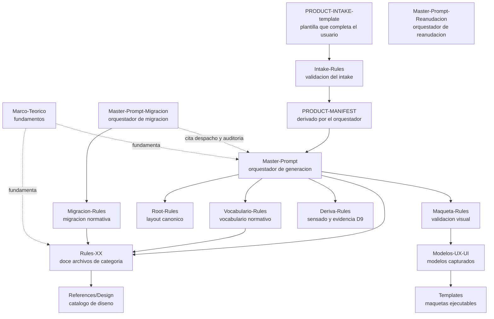
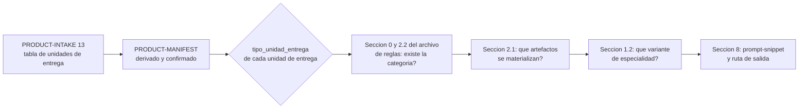
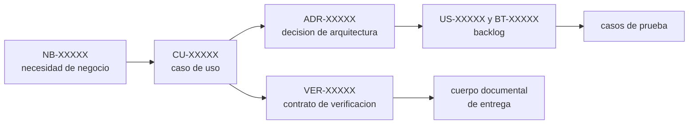

# Guía de desarrollo y extensibilidad del framework SDD

**Documento:** SDD-Development-Guide.md
**Versión:** 1.21
**Estado:** Vigente
**Fecha:** 2026-07-29
**Rol de intervención:** Mantenedor del framework

## Resumen ejecutivo

Esta guía explica cómo está construido el framework SDD por dentro y cómo modificarlo sin romperlo. Sirve a quien desarrolla y extiende el framework mismo, no a quien lo usa sobre un producto. Documenta la anatomía del repositorio, los contratos implícitos entre sus piezas, un procedimiento por cada eje de extensión, los criterios para decidir antes de tocar nada, los errores conocidos al extender y el procedimiento de cambio con su versionado.

No repite el marco teórico. Los fundamentos, la metodología, el catálogo de especialidades y los estilos arquitectónicos viven en [`../Devs/Guides/Marco-Teorico-SDD.md`](../Devs/Guides/Marco-Teorico-SDD.md), con catorce secciones que esta guía referencia y no duplica.

---

## Tabla de contenido

- [1. Para quién es esta guía](#1-para-quién-es-esta-guía)
- [Parte I — Anatomía del framework](#parte-i--anatomía-del-framework)
  - [I.1 Mapa de dependencias](#i1-mapa-de-dependencias)
  - [I.2 Despiece por carpeta](#i2-despiece-por-carpeta)
  - [I.3 Quién lee y quién escribe cada pieza](#i3-quién-lee-y-quién-escribe-cada-pieza)
- [Parte II — Los contratos internos](#parte-ii--los-contratos-internos)
  - [II.1 La estructura canónica de nueve secciones](#ii1-la-estructura-canónica-de-nueve-secciones)
  - [II.2 Cómo el orquestador decide qué generar](#ii2-cómo-el-orquestador-decide-qué-generar)
  - [II.3 El gating de doble granularidad](#ii3-el-gating-de-doble-granularidad)
  - [II.4 Cómo se encadena la trazabilidad](#ii4-cómo-se-encadena-la-trazabilidad)
  - [II.5 Qué espera el auditor de cada fase](#ii5-qué-espera-el-auditor-de-cada-fase)
  - [II.6 Cómo se derivan los flags del intake](#ii6-cómo-se-derivan-los-flags-del-intake)
- [Parte III — Metodología de extensibilidad](#parte-iii--metodología-de-extensibilidad)
  - [III.1 Agregar una categoría documental nueva](#iii1-agregar-una-categoría-documental-nueva)
  - [III.2 Agregar o modificar un artefacto dentro de una categoría](#iii2-agregar-o-modificar-un-artefacto-dentro-de-una-categoría)
  - [III.3 Agregar una variante de especialidad](#iii3-agregar-una-variante-de-especialidad)
  - [III.4 Agregar una fase al orquestador](#iii4-agregar-una-fase-al-orquestador)
  - [III.5 Modificar el gating por tipo D8](#iii5-modificar-el-gating-por-tipo-d8)
  - [III.6 Agregar un modelo UX-UI al catálogo](#iii6-agregar-un-modelo-ux-ui-al-catálogo)
  - [III.7 Modificar una invariante global](#iii7-modificar-una-invariante-global)
  - [III.8 Agregar una regla transversal nueva](#iii8-agregar-una-regla-transversal-nueva)
  - [III.9 Agregar un flag de gating](#iii9-agregar-un-flag-de-gating)
  - [III.10 Por qué el conjunto D8 es cerrado](#iii10-por-qué-el-conjunto-d8-es-cerrado)
- [Parte IV — Criterios y preguntas guía](#parte-iv--criterios-y-preguntas-guía)
- [Parte V — Anti-patrones de extensión](#parte-v--anti-patrones-de-extensión)
- [Parte VI — Procedimiento de cambio](#parte-vi--procedimiento-de-cambio)
- [Control de cambios](#control-de-cambios)

---

## 1. Para quién es esta guía

El framework tiene cuatro documentos de cara al lector y cada uno responde una pregunta distinta. Elegir el equivocado hace perder tiempo, así que conviene declarar la correspondencia antes de seguir.

| Guía | Lector | Responde |
| --- | --- | --- |
| [`SDD-Getting-Started-Guide.md`](SDD-Getting-Started-Guide.md) | Quien arranca por primera vez | «¿Cómo pongo esto a andar hoy?» |
| [`SDD-User-Guide.md`](SDD-User-Guide.md) | Quien **usa** el framework en un producto real | «¿Cómo lo aplico paso a paso?» |
| [`../Devs/Guides/Marco-Teorico-SDD.md`](../Devs/Guides/Marco-Teorico-SDD.md) | Quien quiere entender los fundamentos | «¿Por qué está diseñado así?» |
| **Esta guía** | Quien **desarrolla y extiende el framework mismo** | «¿Cómo está construido por dentro y cómo lo modifico sin romperlo?» |

Es una audiencia que hasta esta versión no tenía documento: el mantenedor del framework, no el de un producto. La diferencia práctica es de dirección de escritura. Quien usa el framework escribe en el repositorio destino y nunca toca este repositorio; quien lo desarrolla escribe acá y no toca ningún producto.

**Prerrequisito de lectura.** Esta guía asume que ya conocés el flujo de fases y el modelo de tres repositorios. Si no, empezá por la guía de usuario: acá esos temas no se repiten.

---

## Parte I — Anatomía del framework

### I.1 Mapa de dependencias

El framework no es una colección de archivos sueltos: es un grafo con dirección. El orquestador lee las reglas, las reglas leen el catálogo de diseño, y todo se apoya sobre las invariantes globales. Nada apunta hacia atrás.



Las líneas punteadas señalan una relación distinta de las demás. El marco teórico **fundamenta** las reglas pero no las gobierna: si el marco y una regla se contradicen, gana la regla y el marco se corrige. La razón es que la regla es ejecutable —un subagente la lee y produce algo— mientras que el marco es explicativo.

### I.2 Despiece por carpeta

| Ruta | Responsabilidad | Cuándo se toca |
| --- | --- | --- |
| `SDD/Devs/Rules/` | Los dieciocho archivos normativos: doce de categoría más seis transversales, `Root-Rules`, `Intake-Rules`, `Maqueta-Rules`, `Deriva-Rules`, `Vocabulario-Rules` y `Migracion-Rules`. Cada uno define qué produce su categoría, con qué estructura y bajo qué criterios | En casi toda extensión |
| `SDD/Devs/Orchestrator/` | Los **tres** master-prompts. `Master-Prompt.md` genera: despacha subagentes por fase, aplica el gating, ordena topológicamente y corta para confirmación humana. `Master-Prompt-Migracion.md` migra: lleva un destino ya especificado a la versión vigente en sus fases M0 a M6, y **cita** el despacho de §8 y la auditoría de §10 del primero en lugar de redefinirlos | Al agregar fases, categorías o flags; el de migración, al cambiar sus fases |
| `SDD/Devs/Intake/` | `PRODUCT-INTAKE-template.md`, que completa el usuario, y `PRODUCT-MANIFEST-template.md`, que deriva el orquestador | Al agregar una sección de intake o un flag derivable |
| `SDD/Devs/Guides/` | Marco teórico y notas de coherencia de auditoría | Al cambiar fundamentos, o al cerrar una intervención |
| `SDD/Devs/References/Design/` | Catálogo de reglas de diseño, por stack y por capacidad transversal, con su índice | Al agregar una capacidad de diseño reutilizable |
| `SDD/Devs/Modelos-UX-UI/` | Modelos UX-UI capturados de maquetas aprobadas, con su índice y su plantilla de registro | Al capturar un modelo nuevo desde una Fase B2 |
| `SDD/Devs/Bootstrap/` | Auditoría del fuente que originó el framework. **Fuente citada, no archivo muerto**: siete archivos de reglas la referencian como origen del rationale de sus correcciones | Nunca se edita; se cita |
| `_legacy/` | Una subcarpeta por versión publicada, con el conjunto normativo completo tal como estaba al publicarse. Permite reconstruir con qué reglas exactas se generó un destino sin recurrir al control de versiones | Al publicar una versión nueva. Lo ya archivado no se toca nunca |
| `SDD/Guides/` | Las tres guías de cara al usuario | Al cambiar algo que el usuario percibe |
| `PROMPTS/` | El prompt de entrada del agente de bootstrap | Al cambiar el modelo de repositorios o el arranque |
| `Templates/` | Maquetas ejecutables de referencia, ofuscadas | Al capturar un template desde una Fase B2 |

**Sobre `Bootstrap/`.** Describe el estado del fuente que originó el framework y es la evidencia de por qué varias reglas son como son: siete archivos de reglas la citan explícitamente al declarar qué déficit corrigen. No se edita. Corregirla para que coincida con el estado actual falsearía el registro, así que cuando una intervención renombra categorías o reasigna subagentes esa carpeta queda deliberadamente desactualizada, y la intervención lo declara en su nota de coherencia.

**Criterio para el material histórico en general.** Un registro histórico se conserva mientras alguien lo cite o mientras explique algo que las reglas vigentes no expliquen por sí solas. Cuando su contenido queda íntegramente absorbido —la propuesta está implementada, el audit cerró aprobado, la plantilla fue reemplazada— y ningún archivo vivo lo referencia, se elimina y su existencia queda registrada en el `CHANGELOG.md`. El historial de git lo preserva. Es lo que se hizo con las carpetas de reformulación y de plantillas de intake superadas.

### I.3 Quién lee y quién escribe cada pieza

| Pieza | La escribe | La lee |
| --- | --- | --- |
| Archivo de reglas de una categoría | El mantenedor del framework | El orquestador al armar el plan; el subagente de esa categoría al generar; el auditor al verificar |
| Master-prompt de generación | El mantenedor del framework | El agente orquestador, en cada corrida |
| Master-prompt de migración | El mantenedor del framework | El agente orquestador de migración, una vez por salto de versión que el destino atraviese |
| `Migracion-Rules.md` | El mantenedor del framework | El orquestador de migración, y todo subagente que re-expresa un documento durante una migración. No la lee ninguna corrida de generación |
| Plantilla de intake | El mantenedor del framework | El usuario, que la completa; el orquestador, que la valida y deriva de ella |
| Catálogo de diseño | El mantenedor del framework | El subagente de UX-UI-DX |
| Modelos UX-UI | El orquestador, con aceptación humana explícita (única excepción de escritura sobre este repositorio) | El humano, al elegir modelo en la Fase B2 |
| Marco teórico | El mantenedor del framework | Quien quiere entender por qué |
| `Vocabulario-Rules.md` | El mantenedor del framework | **Todos**: el orquestador, todo subagente y todo auditor. Es la única regla transversal que `Master-Prompt.md` §8 inyecta en cada despacho, porque su archivo target es todo artefacto que el framework genera |

Un dato que conviene tener presente al extender: **el subagente de una categoría recibe un solo archivo de reglas de categoría, más `Vocabulario-Rules.md`**. No lee los demás. Todo lo que necesite saber sobre una categoría vecina tiene que estar declarado en su propio archivo, típicamente como frontera. Es la causa más frecuente de solapamiento entre categorías, y la que menos se anticipa.

---

## Parte II — Los contratos internos

Las piezas del framework se comunican por contratos que hasta esta guía no estaban escritos en ningún lado. Son la causa más probable de que una extensión rompa algo sin que nadie entienda por qué.

### II.1 La estructura canónica de nueve secciones

Todo archivo de reglas de categoría comparte la misma estructura, de §0 a §9. No es una convención estética: hay despacho y auditoría que la asumen.

| Sección | Contenido | Quién la consume |
| --- | --- | --- |
| §0 | Posición en la cadena SDD: upstream, downstream, gating de la categoría | El orquestador, al armar el plan y ordenar las fases |
| §1 | Especialidad asignada, variantes por tipo D8, multi-especialidad | El orquestador, al elegir el perfil del subagente |
| §2 | Documentos que produce: tabla maestra y reglas de inclusión por tipo | El orquestador, al filtrar qué se genera |
| §3 | Nomenclatura y vinculación: patrón de nombres, identificadores, trazabilidad | El subagente y el auditor |
| §4 | Estructura de redacción por artefacto, tablas tipo, anti-patrones | El subagente |
| §5 | Preguntas guía para el subagente | El subagente |
| §6 | Criterios de aceptación | El auditor de la fase |
| §7 | Ejemplos genéricos | El subagente |
| §8 | Prompt-snippet sugerido | El orquestador, al despachar |
| §9 | Control de cambios | El mantenedor del framework |

**Por qué es rígida.** El orquestador arma cada despacho leyendo §1.2 para la variante de especialidad, §2.1 y §2.2 para filtrar documentos, y §8 para el prompt-snippet y la ruta de salida. El auditor verifica contra §6. Un archivo que mueva ese contenido de lugar obliga a quien lo lea a buscarlo, y quien busca se equivoca.

**Dónde la rigidez es real y dónde no.** Los números de §0 a §9 son estables en los doce archivos de categoría. La numeración de las **subsecciones** de §4 no lo es: la sección de anti-patrones va de §4.4 a §4.9 según el archivo. Por eso el master-prompt la ubica por título y no por número, y toda extensión debe hacer lo mismo.

Las seis reglas transversales no siguen exactamente esta estructura, porque no gobiernan una categoría. `Deriva-Rules.md`, `Maqueta-Rules.md` y `Migracion-Rules.md` tienen su propia organización de §0 a §9 con contenido distinto, y `Vocabulario-Rules.md` la suya de §1 a §11; eso es correcto: la estructura canónica aplica a lo que produce documentación de una carpeta numerada.

Dos direcciones sí son contrato incluso en las transversales, porque el orquestador las resuelve por número y no por título: **§1.2** para la variante de especialidad y **§2.1** para la tabla maestra de artefactos. Una transversal que gobierne artefactos enumerables las declara en esas posiciones, aunque el resto de su organización sea propia. Es la razón por la que `Intake-Rules.md` alojó su tabla maestra en §2.1 en lugar de en la sección que le habría quedado más natural.

### II.2 Cómo el orquestador decide qué generar

La decisión encadena tres entradas y no admite atajos.



El `tipo_unidad_entrega` es el discriminador central. Sale de §13 del intake, se deriva al manifiesto, el humano lo confirma, y a partir de ahí gobierna tres decisiones distintas en cada categoría: si la categoría existe, qué subconjunto de artefactos produce, y con qué perfil profesional se la genera.

**Consecuencia para quien extiende.** Si agregás un artefacto sin declarar su comportamiento para los ocho tipos, el orquestador no sabe si generarlo. En el mejor caso lo genera siempre, que suele ser incorrecto; en el peor, el subagente decide por su cuenta y el resultado varía entre corridas del misma unidad de entrega.

### II.3 El gating de doble granularidad

El framework filtra en dos niveles, y confundirlos produce categorías vacías o artefactos huérfanos.

| Nivel | Pregunta | Dónde se declara |
| --- | --- | --- |
| **Categoría** | ¿Esta categoría existe para este tipo D8? | §0 y §2.2 del archivo de reglas |
| **Artefacto** | Dentro de la categoría, ¿qué documentos se materializan? | §2.1, columnas «Obligatorio para», «Recomendado», «Omitir para» |

Hay un tercer discriminador que se suma a los dos anteriores: los **flags** de §4 del master-prompt. `usa_llm` habilita la categoría 04 entera; `requiere_maqueta` habilita la Fase B2; `tiene_portal_developers` refuerza artefactos de 03 y de 11. Un flag no reemplaza al gating por tipo: se combina con él.

La categoría 11 introdujo una variante que conviene conocer porque puede repetirse: su gating es **por cuerpo**, un nivel intermedio entre categoría y artefacto. La categoría existe siempre, y lo que varía es cuál de sus tres cuerpos —integrador, mantenedor, operador— se materializa. Cuando una categoría agrupa artefactos por rol de lector, ese nivel intermedio resulta más expresivo que la tabla plana de artefactos, porque permite decir «esta unidad de entrega no tiene integradores externos» sin tener que repetir la exclusión en siete filas.

**Regla de cierre.** Toda omisión por gating se registra en `Decisiones-Proyecto.md` de la unidad de entrega. Cuando el equipo omite algo que el gating declara obligatorio, se requiere ADR.

### II.4 Cómo se encadena la trazabilidad

La cadena D6 es lo que hace que la documentación sea auditable en lugar de ser una colección de opiniones.



Cada eslabón declara su upstream en la cabecera del documento y su downstream cuando corresponde. El auditor verifica dos cosas distintas: que las referencias **resuelvan** —el identificador citado existe— y que no haya **huérfanos** —un CU sin NB que lo origine, una BT sin US que la consuma.

**Consecuencia para quien extiende.** Un artefacto nuevo que no declara su lugar en esta cadena es invisible para el auditor. Antes de agregarlo hay que poder responder de qué recibe y a qué alimenta. Si la respuesta honesta es «de nada y a nada», probablemente el artefacto no corresponde a este framework.

### II.5 Qué espera el auditor de cada fase

El auditor se invoca desde cero, sin contexto previo, y lee solo los entregables de la fase, sus insumos upstream y los archivos de reglas correspondientes. Verifica cinco cosas:

1. Conformidad D1 a D9 de cada documento.
2. Cumplimiento de §6 del archivo de reglas, para el `tipo_unidad_entrega` de la unidad de entrega.
3. Coherencia cross-doc dentro de la fase: referencias que resuelven, identificadores no duplicados, glosario sin contradicciones.
4. Trazabilidad declarada y consistente con §3.3 del archivo de reglas.
5. Filename y estructura de carpetas correctos.

Los hallazgos van en cuatro niveles, de P0 a P3, y solo P0 detiene la cadena. El veredicto es `APROBADO`, `APROBADO CON OBSERVACIONES` o `RECHAZADO`.

**Consecuencia para quien extiende.** Si agregás un artefacto y no agregás su criterio en §6, el auditor no lo verifica, y el artefacto puede salir vacío o mal formado sin que nadie lo note. Es el error de extensión más silencioso de todos, porque no falla: simplemente no verifica.

### II.6 Cómo se derivan los flags del intake

Los flags de §4 del master-prompt no los inventa el orquestador ni los pregunta a ciegas: cada uno tiene una regla de derivación desde el intake y una confirmación humana.

| Flag | Se deriva de | Habilita |
| --- | --- | --- |
| `usa_llm` | Declaración explícita de la unidad de entrega en el intake | La categoría 04 completa |
| `tiene_ui_final` | Tipo D8 y declaración del intake | Variante UX/UI de la categoría 03 |
| `requiere_maqueta` | `tiene_ui_final`, `tipo_unidad_entrega` y `tiene_portal_developers`; propuesto por el orquestador y confirmado o invertido por el humano | La Fase B2 y la línea de base del sensado de deriva |
| `tiene_portal_developers` | Declaración del intake sobre SDK público o documentación pública | Documentos DX adicionales en 03; refuerza 10 y 11 |
| `tiene_extensibilidad` | Puntos de extensión declarados en el intake | Artefactos de extensión en 05 y guía de extensión en 11 |

El patrón es siempre el mismo y conviene respetarlo al agregar un flag: **derivar un valor propuesto, presentarlo, y dejar que el humano lo confirme o lo invierta**. Un flag que el orquestador fija sin preguntar convierte una decisión de producto en un efecto secundario de una regla de derivación, y el usuario se entera cuando ve el resultado.

---

## Parte III — Metodología de extensibilidad

Cada eje sigue la misma estructura: qué estás agregando, qué archivos tocar y en qué orden, qué invariantes no se pueden romper, cómo verificar que no rompiste nada, y un ejemplo trabajado.

### III.1 Agregar una categoría documental nueva

**Qué estás agregando.** Una carpeta numerada nueva en la salida, con su archivo de reglas, su subagente y su fase de generación. Es la extensión de mayor impacto después de tocar una invariante.

**Archivos a tocar, en orden:**

1. `SDD/Devs/Rules/Rules-<Nombre>.md` — el archivo nuevo, con la estructura canónica completa de §0 a §9.
2. `SDD/Devs/Rules/Root-Rules.md` — el mapa de documentación del README raíz de la salida y el flujo de lectura por rol.
3. `SDD/Devs/Orchestrator/Master-Prompt.md` — §3.5 layout, §6 plan de generación, §7 ejecución por fases, §14 tabla de adaptabilidad por D8, §15 glosario.
4. Los archivos de reglas de las categorías **vecinas**, para declarar la frontera recíproca.
5. `SDD/Guides/SDD-User-Guide.md` — la descripción de fases, el mapa de carpetas y las FAQ.
6. `README.md` raíz — el mapa de las categorías y la matriz de ruteo.
7. `SDD/Devs/Guides/Marco-Teorico-SDD.md` — solo donde el agregado lo desactualice.

**Invariantes que no se pueden romper.** D3 y D4 en el nombre del archivo y de la carpeta. D6: la categoría declara su upstream y su downstream, y ninguno queda vacío. D8: el gating cubre los ocho tipos, sin dejar ninguno sin decisión.

**Cómo verificar.** Buscá el nombre de la categoría nueva en todo el árbol y confirmá que aparece en los siete lugares del listado. Después verificá algo menos obvio: que el subagente que la genera recibe, en su despacho, todo lo que necesita saber sobre sus vecinas. Lee un solo archivo de reglas.

**Ejemplo trabajado.** La incorporación de la categoría 11 como cuerpo documental de entrega tocó exactamente esos siete lugares. El paso que más fácil se olvida es el cuarto. Sin la frontera declarada desde el lado de la categoría 05, el subagente de arquitectura no sabe que la ubicación de los componentes en el árbol de archivos le corresponde a 11, y la produce igual: la frontera solo frena al agente que la lee.

### III.2 Agregar o modificar un artefacto dentro de una categoría

**Qué estás agregando.** Un documento más en la salida de una categoría existente. Es la extensión más frecuente y la que más veces sale mal por omisión.

**Archivos a tocar, en orden:**

1. §2.1 del archivo de reglas — fila nueva en la tabla maestra, con sus columnas de gating.
2. §2.2 — el comportamiento del artefacto para cada uno de los ocho tipos D8.
3. §3.1 — el patrón de nombre, con su sufijo de versión.
4. §3.3 — su upstream y su downstream.
5. §4.x — la estructura de redacción: qué secciones tiene y en qué orden.
6. §5 — al menos una pregunta guía que ayude al subagente a producirlo bien.
7. §6 — **el criterio de aceptación**. Es el paso que se omite y el que hace que nadie verifique el artefacto.
8. §8 — mencionarlo en el prompt-snippet, para que el subagente sepa que tiene que producirlo.
9. §9 — la fila de control de cambios, con bump **minor**.

**Invariantes.** D3 y D4 en el nombre. D5: si el artefacto reemplaza a otro, el anterior se archiva en `_legacy/`, no se borra. D6: declara upstream y downstream.

**Cómo verificar.** Recorré los nueve puntos y confirmá que el artefacto aparece en todos. Si falta en §6, la extensión está incompleta aunque el documento se genere sin problemas.

**Ejemplo trabajado.** La incorporación del contrato de verificación a la categoría 10 recorrió los nueve pasos, y además tocó `Deriva-Rules.md`, porque el artefacto aportaba sondas a un instrumento gobernado por otra regla. Ese décimo paso —el efecto sobre instrumentos transversales— no siempre aplica, pero conviene preguntárselo antes de cerrar.

### III.3 Agregar una variante de especialidad

**Qué estás agregando.** Un perfil profesional distinto para una categoría existente, típicamente porque un tipo D8 requiere un foco que los perfiles actuales no cubren.

**Archivos a tocar:** §1.2 del archivo de reglas de esa categoría, y §14 del master-prompt si la variante cambia lo que la tabla de adaptabilidad declara para ese tipo.

**Invariantes.** D8: la tabla de §1.2 tiene exactamente ocho filas, una por tipo. Agregar una variante no agrega una fila: reemplaza el contenido de una.

**Cómo verificar.** Contá las filas de §1.2. Si no son ocho, algo se rompió.

**Ejemplo trabajado.** La categoría 11 pasó de tener cuatro variantes con `Technical Writer (opcional)` repetido a tener ocho variantes distintas, una por tipo, cuando el cuerpo mantenedor se volvió obligatorio para todos. El cambio no agregó filas: cambió el contenido de las que ya estaban. Un `(opcional)` repetido en cuatro filas suele ser señal de que la categoría no fue pensada para esos tipos, no de que ahí no haga falta nada.

### III.4 Agregar una fase al orquestador

**Qué estás agregando.** Un corte nuevo en la secuencia de generación, con su audit y su detención.

**Archivos a tocar, en orden:**

1. `Master-Prompt.md` §6 — la fila o filas de la fase en el plan de generación.
2. `Master-Prompt.md` §7 — la fase en la secuencia de ejecución, con sus pasos numerados.
3. `Master-Prompt.md` §10 — los criterios de audit propios de la fase y sus hallazgos P0.
4. `Master-Prompt.md` §15 — el término en el glosario.
5. `SDD/Guides/SDD-User-Guide.md` — la fase en la descripción del flujo, y las FAQ que correspondan.

**Invariantes.** La letra de las fases es secuencial y no se recicla. Toda fase cierra con audit y con detención antes de la siguiente. Si la fase requiere confirmación humana, se declara explícitamente como gate.

**Tres preguntas que hay que responder antes de agregarla:** ¿corre una vez, una vez por unidad de entrega, o una vez por incremento? ¿Qué precondición tiene que cumplirse para que pueda ejecutarse? ¿Qué se regenera y qué se preserva si vuelve a correr?

**Ejemplo trabajado.** Las Fases I y J son el caso más completo, porque son las primeras que operan sobre un repositorio con código. La Fase I obligó a declarar tres cosas que ninguna fase anterior necesitaba: una precondición dura —sin código, sin sample implementado y sin tests que corran, la fase no se ejecuta—, un criterio de re-ejecución que declara qué se preserva entre corridas, incluidas las correcciones manuales del usuario, y un path de informe de audit que distinga cada incremento.

### III.5 Modificar el gating por tipo D8

**Qué estás cambiando.** Si una categoría o un artefacto se genera o no para un tipo determinado.

**Archivos a tocar:** §0 y §2.2 del archivo de reglas si cambia el gating de la categoría; §2.1 si cambia el de un artefacto; §14 del master-prompt si la tabla de adaptabilidad lo refleja.

**Invariantes.** D8: los ocho tipos siguen teniendo una decisión declarada. Un tipo sin fila no es «opcional»: es un hueco.

**Qué se rompe si el gating es incorrecto.** Dos fallas simétricas y de distinto costo. Si el gating es **demasiado laxo**, se generan artefactos que nadie va a leer, y el volumen ahoga a lo que sí importa. Si es **demasiado estricto**, una unidad de entrega queda sin un documento que necesita, y eso se descubre meses después, cuando alguien lo busca y no está. La segunda falla es más cara y menos visible.

**Bump de versión.** Es **major**. La documentación generada con el gating anterior deja de cumplir la regla nueva.

**Ejemplo trabajado.** El cuerpo mantenedor de la categoría 11 pasó de opcional a obligatorio para los ocho tipos. El fundamento: toda unidad de entrega va a ser retomado por alguien, incluso los que no tienen integrador externo, y ese alguien puede no haber participado de ninguna fase de la especificación. Es el caso típico de gating demasiado estricto que se descubre tarde.

### III.6 Agregar un modelo UX-UI al catálogo

**Qué estás agregando.** Un diseño capturado de una maqueta aprobada, disponible como punto de partida para unidades de entrega futuros.

**Archivos a tocar:** un archivo nuevo bajo `SDD/Devs/Modelos-UX-UI/` siguiendo `Rules-Design-Modelo-Template.md`, su fila en `Index-Modelos-UX-UI.md`, y el template ejecutable ofuscado bajo `Templates/`.

**Invariantes.** **D7 es crítica acá y es bloqueante.** El modelo se captura de la maqueta de un cliente real, así que la ofuscación no es una recomendación: es condición de aceptación. Ningún literal del dominio de la unidad de entrega origen puede sobrevivir en el modelo ni en el template.

**Cómo verificar.** Buscá en el modelo y en el template los términos del dominio de la unidad de entrega origen. El resultado esperado es cero, sin matices.

**La vía normal no es manual.** El paso 7 de la Fase B2 ofrece capturar el modelo automáticamente, con aceptación explícita del humano y verificación de ofuscación bloqueante. Agregarlo a mano es la excepción, y pierde esa verificación.

### III.7 Modificar una invariante global

**Qué estás cambiando.** Una de las reglas D1 a D9 que gobiernan todo el framework.

**Es el cambio de mayor impacto que existe**, y conviene entender por qué antes de intentarlo. Una invariante no vive en un archivo: vive en los dieciocho archivos de reglas que la citan, en los dos master-prompts que la inyectan a cada subagente, en los criterios de todos los auditores, y en **toda la documentación ya emitida en todos los repositorios destino**. Cambiar D3, por ejemplo, invalida el nombre de cada archivo que el framework generó alguna vez.

**Archivos a tocar:** todos los que la citen, sin excepción, más el marco teórico donde la fundamenta.

**Procedimiento obligatorio:**

1. Decisión explícita del responsable del framework, registrada por escrito.
2. Barrido completo del árbol buscando toda mención de la invariante.
3. Declaración de si el cambio rige **hacia adelante** o **retroactivamente**.
4. Nota de coherencia con verificación de las nueve invariantes en cada archivo tocado.
5. Entrada en el `CHANGELOG.md` que declare el impacto sobre la documentación ya emitida.

**El precedente a seguir es D9.** Se incorporó después de las ocho originales y se declaró explícitamente que rige hacia adelante y no se aplica retroactivamente, porque reauditar toda la documentación previa contra una regla nueva produce un volumen de hallazgos que ahoga a los reales. Es el criterio por defecto para cualquier invariante nueva.

### III.8 Agregar una regla transversal nueva

**Qué estás agregando.** Un archivo de reglas que no gobierna una categoría documental sino una **capacidad del framework**, como `Maqueta-Rules.md` gobierna la validación visual o `Deriva-Rules.md` el sensado de deriva.

Es el eje que menos se recorre y el que más fácil se confunde con agregar una categoría. La distinción: una categoría produce una carpeta numerada en la salida y tiene un subagente titular; una regla transversal define un mecanismo que **atraviesa** varias categorías y suele delegarse desde el master-prompt.

**Archivos a tocar, en orden:**

1. `SDD/Devs/Rules/<Nombre>-Rules.md` — el archivo nuevo. **No sigue la estructura canónica de nueve secciones de las categorías**: la organiza según el mecanismo, aunque conviene conservar §0 el problema que resuelve, §6 criterios de aceptación, §8 prompt-snippet y §9 control de cambios, que es lo que el orquestador y el auditor consumen.
2. `Master-Prompt.md` — el cableado: en qué fase se invoca el mecanismo, qué flag lo habilita si hay uno, qué criterios de audit aporta y qué término suma al glosario.
3. Los archivos de reglas de las categorías **que el mecanismo atraviesa**, para declarar qué les toca. Es el paso crítico: cada subagente lee un solo archivo de reglas, así que un mecanismo transversal que no se declara en las categorías afectadas no se ejecuta.
4. `SDD/Guides/SDD-User-Guide.md` — si el usuario percibe el mecanismo.

**Invariantes.** El nombre sigue el patrón `<Capacidad>-Rules.md` y no `Rules-<Capacidad>.md`, que está reservado para las categorías. Si el mecanismo introduce una invariante global, se aplica §III.7 y no este eje.

**Cómo verificar.** Confirmá que el mecanismo aparece declarado en cada categoría que atraviesa, no solo en su propio archivo. Es el mismo error que el anti-patrón de la frontera de un solo lado.

**Segundo ejemplo trabajado, y el que muestra el paso que falta.** `Vocabulario-Rules.md` se incorporó en la 5.0 declarando como lector «todo subagente AG-XX», y las diecisiete reglas la citaron desde su cabecera. El paso 2 quedó incompleto: no se sumó a los insumos del despacho de `Master-Prompt.md` §8, así que ningún subagente la recibía y la cita de su cabecera no resolvía. Se corrigió en la 5.1. La lección: para una regla transversal, declarar el lector no es cablearlo; el cableado es la línea del esqueleto de despacho.

**Ejemplo trabajado.** `Deriva-Rules.md` atraviesa 03 (emite la línea de base), 08 (es dueña operativa de la matriz) y 10 (aporta las sondas de contrato). Cuando el sensado se extendió a contratos y comportamiento, el archivo transversal se actualizó y la categoría 08 quedó contradiciéndolo, porque su regla seguía condicionando la matriz a la Fase B2. El defecto no estaba en el mecanismo: estaba en no haber propagado el cambio a la categoría que lo opera.

### III.9 Agregar un flag de gating

**Qué estás agregando.** Una condición booleana derivada del intake que habilita o refuerza artefactos, o que dispara una fase.

**Archivos a tocar, en orden:**

1. `PRODUCT-INTAKE-template.md` — la sección o pregunta de la cual el flag se deriva. Si el flag no tiene de dónde derivarse, no es un flag: es una pregunta más que le hacés al usuario en cada corrida.
2. `Master-Prompt.md` §4 — la fila del flag con su ámbito (producto o unidad de entrega), su fuente, su **regla de derivación** y qué habilita.
3. `Master-Prompt.md` §6 — la columna de gating de las filas que el flag afecta.
4. Los archivos de reglas de las categorías afectadas — §0 y §2.2, para que el subagente sepa qué cambia cuando el flag está activo.
5. `Master-Prompt.md` §15 y `SDD-User-Guide.md` — glosario y explicación al usuario.

**Invariantes.** El flag **se deriva y se confirma**, nunca se fija en silencio. El patrón obligatorio: el orquestador propone un valor a partir de la regla de derivación, lo presenta, y el humano lo confirma o lo invierte. Un flag que el orquestador decide sin preguntar convierte una decisión de producto en un efecto secundario de una regla.

**Cómo verificar.** Respondé tres preguntas: ¿de qué dato del intake se deriva? ¿qué pasa si el humano lo invierte? ¿qué se registra si queda en `false` y el gating declaraba algo obligatorio? Si la tercera no tiene respuesta, falta la ADR de omisión.

**Ejemplo trabajado.** `requiere_maqueta` es el caso más completo, porque combina tres entradas —`tiene_ui_final`, `tipo_unidad_entrega` y `tiene_portal_developers`— para proponer un valor, admite que el humano lo invierta, y su `false` en una unidad de entrega con interfaz visual exige ADR de omisión registrada en 05. Además dispara una fase entera, no solo artefactos.

### III.10 Por qué el conjunto D8 es cerrado

El conjunto de ocho tipos de unidad de entrega es cerrado por diseño, y esta guía no habilita ampliarlo. Conviene entender el fundamento, porque la tentación de agregar un noveno tipo aparece seguido.

**El fundamento.** El `tipo_unidad_entrega` no es una etiqueta descriptiva: es el discriminador del que cuelga todo el comportamiento variable del framework. Cada uno de los doce archivos de reglas tiene al menos dos tablas indexadas por tipo —la de variantes de especialidad en §1.2 y la de gating en §2.2— y varios tienen más. El master-prompt tiene su propia tabla de adaptabilidad. Un tipo nuevo no agrega una fila: agrega **una fila en cada una de esas tablas**, y cada una exige una decisión de diseño real, no un valor por defecto copiado del vecino.

**Qué habría que rehacer si alguna vez se ampliara.** Las doce tablas de §1.2, las doce de §2.2, las tablas de §2.1 con gating por artefacto, la tabla de adaptabilidad del master-prompt, la matriz de estructura de `/samples` de la categoría 10, el gating por cuerpo de la categoría 11, y las reglas de derivación de los flags que dependen del tipo. Son más de treinta tablas, y una fila mal puesta en cualquiera produce documentación incorrecta en silencio.

**Por qué ocho y no otro número.** Los ocho tipos cubren el espacio de formas de entrega de software: biblioteca redistribuible, aplicación web monolítica, aplicación web distribuida, aplicación de escritorio, aplicación móvil, servicio HTTP, herramienta de línea de comandos y servicio de procesamiento en segundo plano. Un caso que no encaja en ninguno suele ser una **combinación** de dos, y el modelo de producto con N unidades de entrega existe precisamente para eso: se modela como dos unidades de entrega tipadas con una dependencia entre ellos, no como un tipo nuevo.

---

## Parte IV — Criterios y preguntas guía

El objetivo de esta parte es que formes criterio, no que sigas una receta. Antes de tocar nada, tenés que poder responder estas preguntas.

**Antes de agregar cualquier cosa:**

- ¿Esto es una categoría nueva o un artefacto dentro de una existente? Si el material tiene un lector distinto, una cadencia distinta y un subagente distinto, es categoría. Si comparte los tres, es artefacto.
- ¿Corresponde al framework o al proyecto de código que lo usa? Si solo aplica a un dominio, un stack o un cliente, no va acá. El framework es agnóstico por D7.
- ¿Qué rol de intervención lo lee? Si la respuesta es «cualquiera», probablemente todavía no lo pensaste.
- ¿Qué categoría vecina se solapa, y dónde está exactamente la frontera? Si no podés enunciar la frontera en una oración, no está clara.
- ¿De qué recibe upstream y a qué alimenta downstream? Un artefacto sin ninguno de los dos es invisible para el auditor.

**Sobre el gating:**

- ¿Qué comportamiento tiene para cada uno de los ocho tipos? Ocho respuestas, no una regla general con excepciones vagas.
- ¿Qué se rompe si el gating es demasiado laxo? ¿Y si es demasiado estricto? Los dos costos son reales y asimétricos.
- ¿Depende de algún flag además del tipo? ¿Ese flag existe o hay que crearlo?

**Sobre la verificación:**

- ¿Cómo va a verificar el auditor que esto se generó bien? Si no podés escribir el criterio de §6, el artefacto no está listo para agregarse.
- ¿El criterio es evaluable, o requiere que alguien interprete? «El documento es claro» no es un criterio.
- ¿La verificación que estás exigiendo es posible en la fase donde la ubicaste? Es el error que se detalla en la Parte V.
- ¿El criterio es **enumerable** o **interpretativo**? Todo criterio de §6 lleva su marca. Ante la duda se marca interpretativo: declarar mecanizable algo que no lo es produce falsa confianza, y la falsa confianza es peor que la ausencia de verificación.

**Sobre qué pregunta el criterio, que es donde más se falla:**

Un criterio de aceptación se escribe casi siempre mirando el artefacto que se quiere obtener —«que exista la tabla», «que tenga al menos una fila»— y produce criterios verificables de un vistazo. Pero la propiedad que hace útil a una declaración casi nunca es del artefacto solo: es de la **relación** entre el artefacto y otra cosa. Que una tabla de trazabilidad sea cierta es una relación entre el sample y el caso de uso; que un glosario esté completo, entre el glosario y los términos usados; que un recuento sea correcto, entre el número y la colección que cuenta. Verificar una relación cuesta más, porque hay que leer los dos lados, y por eso los criterios derivan hacia la presencia. El derive es sistemático, no un descuido de una regla en particular.

- ¿El criterio pregunta si una declaración **está**, o si **es verdadera**? Un artefacto que declara algo falso cumple el primero exactamente igual que uno que declara algo cierto, con lo cual el criterio no discrimina entre los dos casos que existe para distinguir.
- Si la propiedad que importa es una relación, ¿el criterio **nombra los dos lados**?
- **La comprobación barata, y la que más encuentra:** por cada criterio que cuenta algo, preguntarse si una declaración **falsa** sube o baja la cuenta. Un criterio que se cumple **mejor** con un artefacto falso que con uno honesto no es un criterio débil: es un criterio con el signo cambiado. El caso real: «todo caso de uso crítico tiene al menos una sonda que lo ejercita» cuenta casos de uso sin sonda, de modo que una sonda mentirosa lo acerca a cumplirse igual que una verdadera.
- ¿Una declaración verdadera alcanza, o hace falta que sea **verificable**? No son lo mismo. Una trazabilidad que dice la verdad sobre qué pasos recorre sigue sin servir si ninguna aserción falla cuando esos pasos se rompen.
- ¿La pregunta que hace falta ya está escrita en §5, del lado que no bloquea? Las preguntas guía son cantera de criterios: están escritas, están bien formuladas y no detienen nada. **Promover una es más barato que inventarla.**

**Sobre las operaciones que declares, y es donde más se falla:**

Una regla que define una **operación** —renombrar, archivar, fundir, propagar, reabrir— casi siempre
declara qué hace y casi nunca qué **produce como efecto**. Y toda operación produce situaciones
nuevas: renombrar deja punteros apuntando al nombre viejo, archivar baja un documento de nivel y le
acorta las rutas, fundir dos árboles produce colisiones de nombre, propagar hacia una categoría ya
aprobada produce contradicciones. No son casos exóticos: son **consecuencias necesarias** de la
operación, y si la regla no dice qué hacer con ellas, cada agente que las encuentra improvisa.

- ¿Qué situaciones **crea** esta operación que antes no existían? Enumeralas: es una lista corta y se
  agota pensando qué queda distinto después de ejecutarla.
- Por cada una, ¿la regla dice qué hacer? Si la respuesta es «se entiende», no está declarada.
- ¿La operación deja algo **derivado** desactualizado —una ruta, un recuento, un índice—? Eso no se
  arregla pidiendo cuidado: se declara quién lo recalcula.
- ¿Hay un caso que la operación produce y que **no se puede resolver contando**? Ése es el que exige
  detención y decisión humana, y hay que decirlo en la regla en lugar de descubrirlo en una corrida.

Es la misma pregunta que la sección anterior hace sobre los criterios, aplicada a los verbos en lugar
de a los artefactos.

**Sobre cómo verificás una intervención estructural, y es donde se esconde el peor error:**

Una intervención que renombra un concepto o cambia un nivel se verifica casi siempre buscando lo
viejo: que no queden residuos del término anterior, de la ruta anterior, de la variable anterior. Esa
comprobación es necesaria y **no alcanza**, porque tiene un falso negativo que no se ve.

**Un archivo que nunca usó el término viejo pasa la comprobación sin haber sido migrado.** No aparece
en ningún residuo, no genera ningún aviso, y queda hablando del modelo anterior con otras palabras.
Ocurrió: el orquestador de migración quedó dos versiones atrás porque no mencionaba la variable que
se renombró, y la verificación lo contó como conforme.

- ¿Verificaste la **presencia de lo nuevo**, y no solo la ausencia de lo viejo? Son dos preguntas
  distintas y la segunda sola miente.
- ¿Qué archivos del alcance declarado **no cambiaron**? Cada uno necesita una explicación: o no le
  correspondía cambiar, o se olvidó. Un archivo sin cambios dentro del alcance no es una buena
  noticia hasta que se sabe cuál de las dos es.
- Si la intervención cambia un **nivel de aplicación**, ¿cada archivo que ordena un recorrido nombra
  el nivel nuevo? Recorrer es lo que más se olvida, porque el orden no suele nombrar la variable que
  se renombró.

**Sobre las fuentes declarativas que declares:**

Toda regla que crea un documento donde alguien va a **declarar un estado** —en qué etapa va, qué quedó
abierto, contra qué versión se generó— está creando una fuente que puede quedar atrás. Y una fuente que
queda atrás no avisa: sigue afirmando lo último que alguien escribió.

- ¿El documento **nombra a su responsable**, y no sólo el evento en el que se actualiza? «Se actualiza
  al cerrar la etapa» es una oración sin sujeto, y una obligación sin sujeto no la incumple nadie.
- Si ningún rol del producto corresponde, ¿pusiste igual un responsable **genérico** —la organización
  dueña del repositorio— en lugar de dejar el campo vacío? Un campo vacío se lee como que la pregunta
  no se hizo.
- ¿Podés obtener el mismo dato de un **subproducto del acto** —una etiqueta al fusionar, el nombre de
  la rama, el mensaje de confirmación— en vez de un documento que hay que acordarse de actualizar? El
  subproducto no se degrada, porque nadie tiene que recordarlo.
- Si la fuente **no** es un subproducto, ¿declaraste contra qué se la contrasta cuando miente? Ésa es
  la única defensa que le queda.

**Sobre qué forma le das a lo que escribís:**

Un texto normativo correcto puede ser inaplicable **por dónde está y con qué forma**. Ocurrió: una
advertencia específica, con su caso medido, escrita en la sección que gobierna la operación, **no se
aplicó** — porque estaba como bullet en una lista temática, y **a una sección larga no se entra a
leerla, se entra a buscar una cosa**.

Las salidas son **tres**, no dos, y la tercera es la que más se olvida:

| Salida | Cuándo |
| --- | --- |
| **Prosa** | Se lee para **entender o decidir**, no ejecutando |
| **Paso** | Se lee **ejecutando**, su omisión hace daño **y** es olvidable |
| **Paso con su fundamento pegado** | Lo anterior, y además hace falta saber **cuándo no aplica** |

**Las tres condiciones del paso son necesarias juntas.** Algo dañino pero imposible de olvidar no gana
un paso; algo olvidable pero inocuo, tampoco. Sin ese filtro el procedimiento crece hasta dejar de
leerse, que es la forma en que un procedimiento muere.

- ¿Este texto se lee **ejecutando una operación**, o **decidiendo cuál ejecutar**? Lo segundo es prosa,
  por importante que sea.
- ¿Qué pasa si se omite? Si no hace daño, no es paso. **Si hace daño pero nadie lo olvida, tampoco.**
- ¿Hay una **comprobación** que lo detecte después? **Un paso previene; una comprobación detecta, y no
  son sustitutos.** Si el costo de rehacer lo detectado es alto, va como paso **aunque la comprobación
  exista**. Medido: una verificación atrapó tres defectos seguidos, y cada detección costó rehacer una
  categoría entera.
- ¿El paso lleva **su fundamento junto**? Un paso sin fundamento se obedece o se ignora; **nunca se
  adapta**, porque no hay con qué reconocer que este caso es la excepción.
- ¿El procedimiento pasa de **nueve pasos**? Entonces o **se parte en dos puntos de parada** con
  momentos de uso distintos, o **el ítem de menor daño vuelve a prosa**. Agrandarlo no es una opción.
- ¿Está declarado **cuándo se corre**? Un procedimiento sin momento de uso se ejecuta cuando alguien se
  acuerda, que es la definición de lo que no es un procedimiento.

**Y el disparador para revisar la lista es la falla, no la previsión.** La práctica de listas de
verificación lo dice sin rodeos: una lista nunca está bien la primera vez —se prueba, se la mira
fallar y se corrige—. Intentar prever todos los pasos produce listas largas que nadie lee, que es
peor que una lista corta e incompleta.

**Sobre las reglas que escribas a partir de un caso observado:**

Casi toda regla del framework nace de una falla concreta, y ése es su mérito: viene con evidencia. El
riesgo es de forma. **Una regla escrita contra el caso tiende a quedar enunciada sobre el caso**, no
sobre la propiedad que el caso ilustra — y entonces **su simétrico queda afuera sin que nadie lo note,
porque la regla se lee completa**.

Tres familias observadas, y no comparten origen:

| Regla | Se enunció sobre | Lo que quedó afuera | Cuándo apareció |
| --- | --- | --- | --- |
| Comprobación 4, «sin contradicción con lo que ya estaba» | **los archivos tocados** | el concepto fuera del alcance declarado, y **el interior de lo ya tocado** | tres intervenciones seguidas (§VI.3.1) |
| La regla 4 del barrido | **el árbol** | **el texto propio de la intervención** | cinco veces (§VI.3.1) |
| `Migracion-Rules.md` §4.3.2 **E4**, «todo cuerpo se cierra con salto de línea» | **el cierre**, porque el encabezado siguiente quedaba pegado | **la apertura**: el cuerpo pegado a su propio encabezado | cinco categorías de una migración |

**Lo que las tres tienen en común no es el descuido: es que el enunciado quedó pegado al síntoma.** Y
un enunciado pegado al síntoma **no falla ruidosamente**. Cubre su caso, se verifica bien, y el
simétrico produce el mismo daño en una rama que casi no se ejecuta — así que el silencio se lee como
conformidad.

- ¿Esta regla está enunciada sobre **el caso** o sobre **la propiedad**? «Todo cuerpo se cierra» es el
  caso; «encabezado y cuerpo van separados» es la propiedad.
- ¿Cuál es **el simétrico**? Si la regla protege un lado —el de después, el de afuera, el de arriba—,
  ¿qué pasa del otro? La pregunta se contesta antes de publicar, no cuando el otro lado falla.
- ¿La rama que produciría el simétrico **se ejecuta seguido**? Si casi no se ejecuta, **la ausencia de
  hallazgos no es evidencia de que esté cubierta**. Es el caso donde más conviene preguntar.
- Si aparecen dos reglas hermanas, ¿van **juntas o separadas**? **Juntas.** Dos reglas hermanas
  enunciadas por separado vuelven a permitir que se aplique una y no la otra, que es exactamente el
  defecto que se está corrigiendo.

**El límite, y conviene declararlo.** Esto no pide inventar simétricos donde no los hay: hay reglas
cuyo caso **es** la propiedad. Pide **hacerse la pregunta**, que cuesta una línea, y declarar la
respuesta cuando es «no tiene».

**Sobre el impacto:**

- ¿Cuántos archivos toca este cambio? Si son más de tres o cuatro, conviene segmentar en etapas con nota de coherencia entre cada una.
- ¿Invalida documentación ya emitida en repositorios destino? Si la respuesta es sí, es bump major y hay que declarar el impacto.
- ¿Qué le pasa a un producto de un solo unidad de entrega? El caso degenerado con layout aplanado se rompe con facilidad y es el que menos se prueba.

---

## Parte V — Anti-patrones de extensión

| Anti-patrón | Síntoma | Consecuencia | Corrección |
| --- | --- | --- | --- |
| **Duplicar contenido entre categorías en lugar de declarar la frontera** | El mismo tema aparece en dos archivos de reglas con redacción parecida | Divergen en el segundo cambio; el subagente no sabe cuál rige | Declarar la frontera en §0 de ambos archivos: qué documenta cada uno y qué no |
| **Declarar la frontera de un solo lado** | Solo la categoría nueva sabe qué no le corresponde | El subagente de la categoría vieja lee un solo archivo de reglas y produce el material igual | Frontera recíproca: las dos categorías la declaran |
| **Hardcodear un stack comercial en un nombre de archivo** | Aparece el nombre de un producto en un patrón de nomenclatura | El framework queda atado a ese stack; los proyectos de código con otro objetivo no pueden usar la regla | Parametrizar con slug genérico, como `guia-integracion-<sistema-objetivo>` |
| **Agregar un artefacto sin declarar su gating por D8** | La tabla de §2.1 tiene una fila con columnas de gating vacías | El orquestador no sabe si generarlo; el resultado varía entre corridas | Ocho decisiones explícitas, una por tipo |
| **Agregar un artefacto sin criterio en §6** | El artefacto se genera pero ningún audit lo menciona | Sale vacío o mal formado y nadie lo nota. Es el error más silencioso | Criterio de aceptación evaluable por cada artefacto nuevo |
| **Romper la estructura canónica de nueve secciones** | Un archivo de reglas tiene §0 a §7, o mete contenido en una sección que no le corresponde | Quien busca los criterios donde siempre están no los encuentra | Respetar §0 a §9; si el contenido no encaja, va como subsección |
| **Referenciar una sección por número en lugar de por título** | Una regla dice «los anti-patrones de §4.5» | La numeración de subsecciones varía por archivo; la referencia queda rota en la mitad de los casos | Ubicar por título |
| **Introducir una referencia a un repositorio externo** | Aparece una ruta que sale del árbol de este repositorio | Se pierde la autosuficiencia: el repositorio deja de poder clonarse solo | Rutas relativas internas; los estándares se nombran, no se enlazan |
| **Exigir en una fase pre-código una verificación que requiere código** | Un criterio de aceptación pide validar snippets en CI, en una fase donde no hay ni CI ni código | El criterio es incumplible por construcción y se ignora, lo que erosiona la credibilidad de todos los demás | Separar en dos pasadas: declarar el criterio antes, verificarlo después |
| **Corregir el material histórico congelado** | `Bootstrap/` se actualiza para coincidir con el estado actual | El registro deja de reflejar lo que realmente se auditó, y las reglas que lo citan pierden su fundamento | Congelar y declarar la omisión en la nota de coherencia. Si el material ya no lo cita nadie y su contenido está absorbido, eliminarlo y registrarlo en el `CHANGELOG.md` |
| **Modificar la salida sin actualizar la guía de usuario** | El framework genera algo que la guía no menciona | El usuario no sabe qué le va a llegar ni por qué | Toda extensión visible al usuario toca `SDD-User-Guide.md` en la misma intervención |

El anti-patrón de la verificación imposible merece una nota, porque motivó la intervención más grande que el framework tuvo. La categoría de documentación se generaba antes del handoff, pero sus criterios de aceptación exigían validar snippets contra código, medir tiempos de onboarding con un developer real y verificar que los códigos de error documentados coincidieran con los que el sistema emite. Nada de eso existe antes de codificar. El archivo estaba redactado con la voz de una categoría post-implementación y ubicado en una fase pre-implementación. La corrección fue estructural: partir la generación en pasadas, declarar el criterio cuando todavía se puede discutir y verificarlo cuando hay contra qué.

---

## Parte VI — Procedimiento de cambio

### VI.1 Cómo se versiona un archivo de reglas

| Tipo de cambio | Bump | Ejemplos |
| --- | --- | --- |
| Corrección de redacción sin cambio semántico | Ninguno | Erratas, aclaraciones, reordenamiento de párrafos |
| Incorporación que no invalida lo vigente | **Minor** | Un artefacto más, un anti-patrón, un criterio de aceptación, una pregunta guía |
| Cambio que invalida documentación ya generada | **Major** | Cambio de gating, artefacto obligatorio nuevo, renombre de carpeta target, reasignación de subagente, cambio de estructura obligatoria |

La pregunta que resuelve las dudas: **¿un documento generado con la versión anterior sigue cumpliendo la nueva?** Si no, es major.

### VI.2 Qué se registra en el control de cambios

Cada archivo modificado incorpora su fila en §9, con versión, fecha, descripción y autor. La descripción dice **qué cambió y por qué**, en términos del framework. No dice quién lo pidió ni desde dónde: un archivo de reglas no referencia el prompt que lo modificó, porque eso rompería la autosuficiencia del repositorio.

Autor válido: el rol del subagente titular de la categoría, o el nombre de la intervención.

Las filas ya escritas **no se reescriben**, aunque un cambio posterior invalide lo que describen. Son registro histórico, y corregirlas hace que el changelog mienta. Si una intervención renombra una carpeta, las filas viejas siguen nombrando la carpeta vieja, y la fila nueva declara el renombre.

### VI.3 Cómo se verifica la coherencia después de un cambio

Toda intervención que toque más de un archivo emite una nota de coherencia siguiendo el patrón de [`../Devs/Guides/Coherencia-Auditoria-Marco.md`](../Devs/Guides/Coherencia-Auditoria-Marco.md), que define la forma: alcance, inventario de archivos tocados, verificación de invariantes, verificación de trazabilidad, observaciones y veredicto. **Cuando la intervención cambia un concepto, suma una sección de barrido declarado** con la forma que fija §VI.3.2: el par forma anterior / forma vigente, el residuo de la corrida y las exclusiones enumeradas con su motivo. Sin esa sección, la comprobación 8 no es verificable por nadie que no sea quien la corrió.

Lista de comprobación mínima:

| # | Comprobación | Resultado esperado |
| --- | --- | --- |
| 1 | Invariantes D1–D9 intactas en todo archivo tocado | Sin violaciones |
| 2 | Autosuficiencia: cero referencias fuera del árbol de este repositorio | Cero ocurrencias |
| 3 | Referencias internas: todo archivo, carpeta y sección citada existe. **Se excluyen las rutas ilustrativas dentro de los ejemplos de las reglas**, que describen el árbol de un destino y no resuelven desde el framework | Cero enlaces rotos fuera de esa exclusión |
| 4 | Sin contradicción entre lo escrito y lo que ya estaba | Sin contradicciones, o reportadas |
| 5 | Control de cambios actualizado en cada archivo modificado | Una fila por archivo |
| 6 | El caso degenerado sigue produciendo el layout aplanado | Verificado |
| 7 | Nada fuera del alcance declarado fue modificado | Sin cambios colaterales |
| 8 | **Barrido por concepto**: la intervención **declara la forma anterior como patrón** (§VI.3.2) y lo corre sobre todo el árbol vivo, incluidos los bloques cercados y el interior de los archivos ya tocados, **y sobre su propio texto** | **Cero ocurrencias vivas** fuera de **las siete clases estables de §VI.3.2, que se citan y no se reescriben**, y de las exclusiones propias del caso, enumeradas con su motivo |
| 9 | **Coherencia interna de cada artefacto tocado**: ninguna sección contradice a otra del mismo archivo | Sin contradicciones internas |
| 12 | **Cobertura del catálogo de criterios**: todo criterio de decisión que la intervención agrega, cambia de lugar o retira está reflejado en [`Catalogo-De-Criterios.md`](../Devs/Rules/Catalogo-De-Criterios.md) | El catálogo enumera los criterios vigentes, sin faltantes ni entradas muertas |
| 11 | **Cobertura de la nota de coherencia**: toda entrada del `CHANGELOG.md` cuya intervención tocó **más de un archivo** tiene su nota, y la nota declara la versión del conjunto que resultó | Una nota por entrada multiarchivo, sin huecos |
| 10 | **Integridad del registro** de cada archivo tocado: la versión de cabecera **es** la mayor fila del control de cambios, las filas están **en orden** y **ninguna está repetida** | Cabecera igual a la última fila, tabla ordenada |
| 13 | **Devolución al origen**: cuando la intervención declara un **origen** —un reporte, un incidente, un pedido—, la nota **enumera los criterios de aceptación que ese origen fija** y declara, uno por uno, **cuál quedó cumplido y cuál no** | Un veredicto por criterio. **Ningún origen se declara resuelto con un criterio sin contestar** |

**Por qué la comprobación 3 excluye los ejemplos.** Las reglas ilustran el árbol de un destino con
enlaces como `[00-Contexto](00-Contexto/)`, que **no resuelven desde la ubicación de la regla y no
tienen por qué**: describen la salida, no la navegación del framework. Sin la exclusión son catorce
avisos permanentes, y una comprobación que avisa siempre **es una comprobación apagada** —es el mismo
argumento con el que la 8.3 excluyó `_legacy/` como origen—.

**Por qué la comprobación 12 existe, y por qué no alcanzaba con anotarlo.** La versión 1.0 del
catálogo declaró como limitación que «el índice se desactualiza si un criterio nuevo no se agrega».
**Eso no es una limitación: es una obligación que faltaba escribir.** Un índice cuyo mantenimiento
depende de que alguien se acuerde reproduce exactamente el problema que vino a resolver, y el método ya
sabe cómo se corrige eso —la misma forma que D5 usa para el control de cambios: quien toca, registra—.

**Por qué la comprobación 13 existe, y qué defecto medido la produce.** Una intervención que nace de
un origen **contesta menos de lo que el origen pedía y lo declara resuelto igual**, porque lo que la
verificación mira es el árbol que quedó y no el encargo que la trajo. Medido: una intervención publicó
su versión declarando resuelto un origen de **cinco criterios de aceptación** con **uno sin auditar** —el
que pedía barrer una clase entera, y no el caso que la originó—. Las doce comprobaciones anteriores
pasaron todas, y ninguna podía verlo: **el trabajo que faltaba no estaba en ningún archivo tocado**.
Lo levantó una verificación posterior, y para entonces la versión ya estaba publicada y el registro ya
decía «resuelto».

**Se enuncia sobre la propiedad y no sobre el caso**, que es lo que la Parte IV exige desde la 1.19: no
dice «el reporte», dice **el origen**, cualquiera sea su forma, porque lo que produce el defecto no es
de qué tipo es el encargo sino que **su criterio de aceptación viva afuera del árbol que la intervención
verifica**.

**Y no cita ese afuera, a propósito.** La comprobación 2 exige autosuficiencia —cero referencias fuera
de este repositorio— y una comprobación que nombrara dónde vive el origen la rompería. Lo que se exige
es que **la nota traiga los criterios adentro**: enumerados, con su veredicto. Un criterio que nadie
transcribió no se puede contestar, y ésa es exactamente la forma en que este defecto se produce.

**Por qué la comprobación 11 existe.** §VI.3 exige la nota desde siempre y **nadie verificaba que se
hubiera emitido**. En una serie de siete intervenciones consecutivas, **dos de las que la necesitaban
no la tenían**, y se descubrió al revisar la cobertura a mano. Es enumerable: se contrastan las
entradas del `CHANGELOG.md` contra el campo «versión del conjunto resultante» de las notas. La
obligación existía y le faltaba, otra vez, **ser una corrida en lugar de una lección**.

**Por qué la comprobación 10 existe y la 5 no alcanzaba.** La 5 pide «una fila por archivo», y se cumple
escribiendo la fila **en cualquier lado**. Insertarla antes de la última en lugar de después deja la tabla
desordenada; subir la cabecera y olvidar la fila deja un archivo que **declara una versión que su propio
registro no conoce**. Ninguna de las dos rompe nada visible, y por eso se acumulan: **seis archivos las
tenían**, repartidas entre cuatro intervenciones, y ninguna verificación las miraba. Es enumerable y
mecánica, que es la condición que `Master-Prompt.md` §10.0 usa para no dejarla a criterio de nadie.

El veredicto es `CONFORME` o `NO CONFORME`. Con `NO CONFORME` no se avanza: se corrige y se reemite.

### VI.3.1 El barrido por concepto, y por qué la comprobación 4 no alcanzaba

**La lista tenía desde el principio «sin contradicción entre lo escrito y lo que ya estaba», y tres
intervenciones seguidas la pasaron dejando una contradicción adentro.** No porque nadie la corriera:
porque **está enunciada sobre los archivos tocados**, y los tres defectos vivían en lugares que la
intervención había tocado sin mirar, o que ni siquiera figuraban en su alcance.

**Los tres casos, que son el mismo caso:**

| Intervención | Qué cambió | Qué quedó atrás | Cuándo se descubrió |
| --- | --- | --- | --- |
| **8.0** | El bloque técnico del intake pasa de colgar del proyecto de código a colgar de la unidad de entrega | **La tabla de identidad dentro de ese mismo bloque** siguió pidiendo el valor D8 al proyecto de código, contra lo que otra sección del mismo archivo declaraba | **Tres versiones después**, al completar un intake real |
| **8.0** | El modelo pasa a dos niveles | **El orquestador de migración** siguió describiendo el modelo anterior | **Dos versiones después**, al ir a ejecutarlo |
| **8.0** | Ídem | La propia nota de coherencia registró que **la intervención cometió el defecto que corregía** en su propio alcance | En la misma intervención, y aun así volvió a pasar |

**Qué tienen en común.** En los tres, la intervención cambió **un concepto** —el nivel del que cuelga
un bloque, el modelo de niveles— y verificó **los archivos que editó**. Lo que falló no fue el
cuidado: fue que **el alcance se declaró por archivo y el cambio era por concepto**.

**El procedimiento.** Antes de cerrar una intervención que cambia un concepto —el nivel de un
artefacto, el dueño de un campo, un conjunto cerrado, el nombre de un término normativo—:

1. **Enumerar el concepto, no los archivos.** Buscar el término y sus formas en **todo el árbol**, sin
   filtrar por el alcance declarado. La lista resultante es el alcance real, y casi siempre es mayor
   que el declarado.
2. **Incluir el interior de lo ya tocado.** Un archivo editado no queda verificado por haberlo
   editado: una plantilla puede quedar contradiciéndose entre dos de sus propias secciones, y **eso no
   lo detecta ninguna comprobación entre archivos**.
3. **Declarar las apariciones que se dejan.** Una aparición que **no** se cambia se enumera con su
   motivo —es una cita histórica, es un ejemplo, es otro referente—. Lo que no se puede es que quede
   sin mirar, porque entonces no hay forma de distinguirla de un olvido.
4. **Verificar contra la propia intervención.** La pregunta final no es «¿toqué todo lo que había que
   tocar?» sino **«¿mi intervención cometió el defecto que corrige?»**. Las tres veces la respuesta
   era sí, y las tres veces se podía haber contestado antes de publicar.
5. **Entrar en los bloques de ejemplo.** Un cerco de código no es un límite del barrido: las
   **plantillas de cabecera** de las diez reglas de categoría viven ahí, y son lo que cada documento
   generado copia literal. Tres barridos seguidos las pasaron de largo porque buscaban en rutas, en
   prosa y en tablas, y **veintiséis cabeceras siguieron declarando el nivel que la 8.0 había
   cambiado**. Un ejemplo que enseña mal se propaga a todo lo que se genera con él.

### VI.3.2 El barrido se declara como patrón y se corre, no se recuerda

**Las cinco veces que una intervención cometió el defecto que corregía, el defecto tenía una forma
anterior literal.** `Proyectos/`, `README §5`, `{{NOMBRE_PROYECTO_CODIGO}}`, `proyecto de código
principal`, `**Proyecto de código:**`. Ninguna era difícil de encontrar: **ninguna estaba escrita en
ninguna parte**. El barrido dependía de que quien interviene recordara qué buscar, y cinco veces
seguidas la memoria falló donde un `grep` no habría fallado.

**Qué obliga.** Toda intervención que cambia un concepto declara, en su nota de coherencia, el par:

| Concepto | Forma anterior (patrón literal) | Forma vigente |
| --- | --- | --- |
| {{qué cambió}} | {{la cadena que hay que dejar de encontrar}} | {{la cadena que la reemplaza}} |

**La forma anterior es un patrón de búsqueda, no una descripción.** «El nivel del bloque técnico» no
sirve; `**Proyecto de código:**` sí. Si el concepto no se puede reducir a una cadena, se declara así y
se dice por qué —ver el límite, más abajo—.

**Cómo se verifica, y qué resultado es aceptable.** Se corre el patrón sobre **todo el árbol vivo,
incluidos los bloques cercados**, y el residuo tiene que ser **cero fuera de las exclusiones
enumeradas una por una con su motivo**. Las clases de exclusión son estables y se enumeran acá para
que no se redescubran cada vez:

| Clase | Por qué se excluye |
| --- | --- |
| Filas de control de cambios | Son registro de lo que se verificó en su fecha; reescribirlas lo falsea |
| `_legacy/` | Es el conjunto archivado, y §VI.5 lo declara intocable |
| `SDD/Devs/Bootstrap/` | §I.2 la declara no editable: es la evidencia del origen |
| Notas de coherencia anteriores | Relatan un hallazgo de su fecha |
| Rutas ilustrativas de los ejemplos | Describen el árbol de un destino, no la navegación del framework (§VI.3, comprobación 3) |
| Renombres declarados | «Reemplaza a las antiguas X» es lo que permite reconocer un destino generado con la versión vieja |
| **La declaración de la propia intervención** | Escribe la forma anterior **como patrón literal** porque esta misma sección se lo exige: **nombrarla es su función**. Un barrido que no pudiera nombrar lo que corrige sería inútil. Observado en dos intervenciones seguidas, y en la primera **no se enumeró**: la corrida afirmó cero con dos ocurrencias vivas, y una auditoría posterior lo levantó como P2 |

**La sección de barrido de la nota de coherencia CITA esta tabla en lugar de reescribirla**, y
enumera **sólo las exclusiones propias de su caso**. La tabla se escribió «para que no se redescubran
cada vez» y aun así **tres intervenciones seguidas la reconstruyeron a mano**, acertando en lo que su
residuo les mostró y omitiendo el resto. El motivo no es de contenido sino de ubicación: la lista vive
acá y **la nota se escribe mirando el residuo**. Enumerar una vez no alcanza si nada pone la lista
delante de quien enumera.

**Y la regla 4 se corre con los mismos patrones sobre lo que la intervención acaba de escribir.** Es
la parte que faltó las cinco veces: el barrido se corrió sobre el árbol y **no sobre el texto propio**.
Una intervención que introduce la forma vigente puede introducir también la anterior —en un ejemplo
nuevo, en una fila nueva, en una cita— y es el único lugar donde nadie está mirando.

**El límite, declarado.** Esto cubre los conceptos con **huella textual**: renombres, cambios de
nivel, nombres de variable y de campo. **No cubre un cambio semántico sin forma anterior distinta** —
cuando la 8.14 pasó a exigir que toda fuente declarativa nombre a su responsable, no había ninguna
cadena vieja que buscar—. Para ésos la regla 4 sigue siendo una lectura, y la nota lo declara en lugar
de simular una corrida. **Un control que dice qué no cubre es un control; uno que pretende cubrir todo
es lo que nos trajo hasta acá.**

**Por qué una plantilla es el peor lugar para dejar una contradicción.** No rompe nada hasta que
alguien la completa, y para entonces el producto ya arrastra el dato mal declarado. Es el artefacto
del framework con **más superficie de contacto**: cada producto nuevo la lee entera, y la lee para
obedecerla.

**Intervenciones grandes: segmentar.** Una intervención que toca más de tres o cuatro archivos conviene partirla en etapas, cada una con nota de coherencia propia y confirmación humana entre medio. Cada etapa debe cumplir tres condiciones: dejar el framework en estado consistente y utilizable aunque la intervención se abandone ahí, ser verificable por sí sola sin depender de una etapa posterior, y no definir dos veces el mismo artefacto. Es el mismo patrón de auditoría entre fases que el framework aplica en sus propias corridas, aplicado a su propio desarrollo.

Una regla que vale la pena adoptar: **un descubrimiento no habilita un cambio**. Si durante una etapa aparece algo que exigiría modificar el resultado de una etapa ya cerrada, no se modifica en silencio. Se registra como observación, se reporta y se espera decisión.

### VI.4 Qué hacer cuando un cambio obliga a regenerar documentación ya emitida

Es la parte más incómoda del procedimiento y la que más se posterga. Un bump major de un archivo de reglas significa que la documentación generada con la versión anterior ya no cumple.

Opciones, en orden de preferencia:

1. **Regeneración parcial.** El orquestador vuelve a correr solo la categoría afectada de la unidad de entrega afectado, y el sensado de deriva devuelve a `Sin verificar` las filas que dependen de lo regenerado. Es la vía normal.
2. **Regeneración con preservación de correcciones manuales.** Si el usuario editó a mano los documentos, se aplica el patrón de re-ejecución: el orquestador relee, enumera las diferencias, informa cómo las interpretó y espera confirmación antes de propagar.
3. **Congelar la versión anterior.** Si regenerar no es viable, la documentación existente se marca con la versión de reglas contra la cual se generó, y el cambio se aplica solo a productos nuevos.

Lo que **no** es una opción es dejar documentación emitida contra una versión de reglas que ya no existe, sin declararlo. Un lector que sigue una regla derogada no tiene forma de saber que la está siguiendo.

**Registro obligatorio.** Todo bump major se anota en el `CHANGELOG.md` de la raíz declarando explícitamente el impacto sobre la documentación ya emitida, aunque la decisión sea no regenerar nada.

**Forma del registro: el bloque «Impacto sobre destinos existentes».** Declararlo en prosa no alcanza, y el motivo es concreto: hay una clase de cambio que ningún diff de versiones puede inferir. Que un artefacto pasó a llamarse de otra manera no se deduce de que su regla haya subido de 2.1 a 3.0. El número dice que algo incompatible pasó; no dice qué. Ese conocimiento existe, pero vive disperso en la prosa de las entradas y de las notas de coherencia, donde un agente que tiene que reconocer un destino generado con la versión vieja no lo puede resolver.

Por eso toda entrada major del `CHANGELOG.md` incluye un bloque con este título y estas tres tablas. Una tabla sin contenido se declara vacía; no se omite, porque «no hay renombres» y «nadie los enumeró» son dos cosas distintas:

```text
### Impacto sobre destinos existentes

**Renombres de artefacto**

| Nombre anterior | Nombre vigente | Naturaleza |
| --- | --- | --- |
| {{anterior}} | {{vigente}} | archivo / carpeta / identificador / campo |

**Secciones movidas o partidas**

| Documento | Sección anterior | Destino vigente |
| --- | --- | --- |
| {{documento}} | {{sección}} | {{una o más secciones vigentes}} |

**Campos bloqueantes nuevos**

| Documento | Campo | Regla que lo exige |
| --- | --- | --- |
| {{documento}} | {{campo}} | {{archivo de reglas y sección}} |
```

**Qué gana el framework con esto.** Un renombre declarado en tabla es resoluble por lectura directa: el agente que arranca sobre un destino viejo puede reconocer los nombres legados en lugar de detenerse al no encontrar los vigentes. Lo que **no** es este bloque: un playbook de migración por salto de versión. Un playbook describiría la transformación paso a paso, duplicando el estado objetivo que las reglas ya declaran en sus §2.1, §2.2 y §6, con la obligación de mantener las dos declaraciones sincronizadas. Esto es un bloque en un archivo que ya existe, que ya era obligatorio en prosa por el párrafo anterior, y que pasa a tener forma legible.

La opción 3 depende de dos cosas que el framework provee desde la versión 4.0: que el destino declare contra qué versión se generó, en el bloque de procedencia de su `PRODUCT-MANIFEST`, y que esa versión siga siendo reconstruible, en `_legacy/`. Sin las dos, «congelar la versión anterior» es una intención sin instrumento.

### VI.5 Cómo se versiona el framework como conjunto

Los archivos se versionan uno por uno según VI.1. El framework además se versiona **como conjunto**, y esa es la versión que un destino cita para declarar bajo qué normativa se generó.

**Dónde vive.** En el `CHANGELOG.md` de la raíz. Una entrada equivale a una versión publicada. No hace falta ningún otro registro: el log del control de versiones registra commits, que es otra cosa y no se mezcla con esto.

**Cómo se deriva.** De la mayor severidad de sus partes:

| La versión del conjunto sube… | Cuando… |
| --- | --- |
| **major** | alguna regla sube major, **alguna plantilla de intake sube major**, o se modifica una invariante D1-D9 |
| **minor** | alguna regla o plantilla sube minor y ninguna sube major |
| **patch** | no cambia ninguna regla ni plantilla, ni el comportamiento de ningún orquestador |

**Por qué las plantillas cuentan.** La tabla hablaba solo de reglas, y las dos plantillas de `SDD/Devs/Intake/` se versionan aparte de ellas: un cambio estructural de `PRODUCT-INTAKE-template.md` o de `PRODUCT-MANIFEST-template.md` no mueve la versión de `Intake-Rules.md` ni de ninguna regla de categoría. El caso quedaba sin contemplar, y el criterio sustantivo de §VI.1 lo resuelve igual: si un documento generado con la versión anterior deja de cumplir, es major, y no importa si lo que subió fue una regla o una plantilla. Se declara acá para no tener que volver a derivarlo cada vez.

**Qué obliga.** Publicar una versión nueva incluye, en la misma intervención, copiar el conjunto normativo que queda superado a `_legacy/<version>/`. Se copia el conjunto entero y no solo los archivos que cambiaron, porque las reglas son interdependientes: un `Rules-Contexto` de una versión junto a un `Master-Prompt` de otra puede producir una combinación que nunca existió y nunca se auditó. Lo que hay que poder reconstruir es el estado coherente.

Quedan fuera del snapshot el propio `CHANGELOG.md`, que es acumulativo y cuya historia es su contenido, la carpeta `_legacy/` misma, y los archivos de configuración del repositorio, que no condicionan lo que el orquestador genera.

**Cuándo se toma el snapshot, que es donde se rompe.** `_legacy/<N>/` contiene el conjunto **tal como
estaba antes de aplicar la intervención que publica `N+1`**. Copiarlo después de editar produce una
carpeta que lleva el nombre de una versión y el contenido de la siguiente, y **es un error silencioso**:
la carpeta existe, tiene el conjunto entero y parece correcta.

**Lo que rompe no es el archivo histórico, es la migración.** `Master-Prompt-Migracion.md` construye
el diff normativo de un salto leyendo `_legacy/`. Si `_legacy/<N>/` contiene en realidad el conjunto
`N+1`, el diff de ese salto **sale vacío**, y una migración que no tiene nada que aplicar se declara
completa sin haber hecho nada. Un snapshot corrido un lugar es más dañino que un snapshot ausente,
porque el ausente se nota.

**Verificación, y es mecánica.** Terminada la intervención, la versión de cabecera de cada archivo de
`_legacy/<N>/` tiene que coincidir con la que ese archivo tenía **antes** de los cambios de `N+1`, no
con la de ahora. Alcanza con contrastar los archivos que la intervención tocó: **si alguno muestra su
versión nueva dentro de `_legacy/<N>/`, el snapshot se tomó tarde**. La forma segura de tomarlo es
desde el estado sin editar —el control de versiones lo tiene— y no copiando el árbol de trabajo.

**Y la intocabilidad no cubre esto.** Una subcarpeta que archiva el conjunto equivocado no es un
registro que se corrige: es un registro que nunca se escribió. Reconstruirla desde el estado que le
corresponde **no reescribe historia, la restituye**; lo que no se puede es editarle el contenido para
que diga otra cosa.

**Qué obliga además cuando el conjunto sube major.** La entrada del `CHANGELOG.md` lleva el bloque «Impacto sobre destinos existentes» con la forma que declara §VI.4. Se cumple una vez por entrada, aunque el major provenga de varias partes: el bloque consolida los renombres de artefacto, las secciones movidas y los campos bloqueantes nuevos de la intervención entera, que es la unidad que un destino atraviesa cuando pasa de una versión del conjunto a la siguiente.

**Intocabilidad.** Una subcarpeta de versión, una vez creada, no se modifica nunca. Es la misma razón por la que las filas de control de cambios no se reescriben: un registro que se corrige después deja de ser un registro.

---

## Control de cambios

| Versión | Fecha | Cambios | Autor |
| --- | --- | --- | --- |
| 1.0 | 2026-07-26 | Versión inicial de la guía de desarrollo del framework. Parte I anatomía, con mapa de dependencias en Mermaid, despiece por carpeta y matriz de quién lee y escribe cada pieza. Parte II con los seis contratos internos: estructura canónica de nueve secciones, decisión de generación, gating de doble granularidad, encadenamiento de la trazabilidad, expectativas del auditor y derivación de flags. Parte III con siete ejes de extensión, cada uno con archivos a tocar, invariantes, verificación y ejemplo trabajado, más el fundamento del conjunto cerrado D8. Parte IV con las preguntas guía agrupadas por decisión. Parte V con once anti-patrones de extensión. Parte VI con versionado, control de cambios, verificación de coherencia, segmentación de intervenciones grandes y tratamiento de la documentación ya emitida. | Reformulación SDD |
| 1.1 | 2026-07-26 | Dos ejes de extensión nuevos en la Parte III: §III.8 agregar una regla transversal, con la distinción respecto de agregar una categoría y el ejemplo del sensado de deriva atravesando tres categorías; y §III.9 agregar un flag de gating, con el patrón obligatorio de derivar, presentar y confirmar, y el ejemplo de `requiere_maqueta`. El fundamento del conjunto cerrado D8 se renumera a §III.10. | Reformulación SDD |
| 1.2 | 2026-07-28 | Normalización del versionado (framework 4.0). §I.2 suma la carpeta `_legacy/` a la anatomía. §VI.4 declara que la opción de congelar la versión anterior depende del bloque de procedencia del destino y de que la versión siga siendo reconstruible. **§VI.5 es nueva**: versionado del framework como conjunto, con el `CHANGELOG.md` como registro único, la derivación de la severidad a partir de sus partes, la obligación de copiar el conjunto normativo superado a `_legacy/<version>/` y la regla de intocabilidad de lo archivado. | Revisión SDD |
| 1.3 | 2026-07-29 | Vocabulario normativo (framework 5.0). La guía adopta «producto» y «proyecto de código» en las seis partes. Fila registrada retroactivamente en la 5.1: la migración subió la versión de cabecera a 1.3 sin dejar su fila, y §I.2, §II.1 y §III.7 quedaron declarando dieciséis archivos de reglas y cuatro transversales cuando la propia intervención agregó el decimoséptimo. | Reformulación SDD |
| 1.4 | 2026-07-29 | Puesta al día contra el conjunto 5.1 y el decimoséptimo archivo de reglas. **Corregidos tres conteos** que contradecían al `README.md` raíz: §I.2 decía «los dieciséis archivos normativos … más `Root-Rules`, `Intake-Rules`, `Maqueta-Rules` y `Deriva-Rules`», §II.1 «las cuatro reglas transversales» y §III.7 que una invariante «vive en los dieciséis archivos de reglas»; pasan a diecisiete y cinco. **§I.1** suma el nodo `Vocabulario-Rules` al mapa de dependencias, con sus dos aristas: la del master-prompt, que la inyecta, y la de las reglas de categoría, que la citan. **§I.3** la incorpora a la tabla de quién lee cada pieza, declarándola como la única regla transversal que llega a todo subagente, y corrige la nota que decía que el subagente «recibe un solo archivo de reglas». **§III.8** suma un segundo ejemplo trabajado, el de `Vocabulario-Rules` en la 5.0, cuyo paso 2 quedó incompleto —lector declarado sin cablear en el esqueleto de despacho— con la lección explícita de que declarar el lector no es cablearlo. Se restituye el salto de línea final del archivo, que faltaba, y se unifica la versión, que el front-matter declaraba como 1.2 mientras la cabecera declaraba 1.3: el mismo defecto de doble declaración que traía `SDD-Getting-Started-Guide.md`. | Revisión SDD |
| 1.5 | 2026-07-29 | Forma obligatoria del registro de impacto en las entradas major (prerrequisito F4 de la migración normativa). **§VI.4** suma la especificación del bloque «Impacto sobre destinos existentes»: tres tablas —renombres de artefacto, secciones movidas o partidas y campos bloqueantes nuevos—, con la regla de que una tabla sin contenido se declara vacía y no se omite. El fundamento es que hay una clase de cambio que ningún diff de versiones puede inferir: un renombre de artefacto no se deduce de que su regla haya subido de 2.1 a 3.0, y ese conocimiento vivía disperso en prosa, donde un agente que tiene que reconocer un destino legado no lo puede resolver. Se declara además qué **no** es el bloque —un playbook de migración por salto de versión, que duplicaría el estado objetivo ya declarado en las reglas y obligaría a mantener dos declaraciones sincronizadas—, para que la concesión no se lea como habilitación de esa forma. **§VI.5** declara la obligación correlativa al publicar un conjunto major, y que se cumple una vez por entrada consolidando la intervención entera, no una vez por regla que sube. Sube **minor**: precisa la forma de un registro que ya era obligatorio, sin cambiar ningún procedimiento existente. | Framework SDD (migración normativa) |
| 1.6 | 2026-07-29 | Puesta al día contra el conjunto 6.0 y la decimoctava regla. **Tres conteos corregidos**, los mismos ejes que la 1.4 ya había tenido que corregir una vez: §I.2 pasa de diecisiete archivos normativos y cinco transversales a dieciocho y seis, §II.1 de «las cinco reglas transversales» a seis, y §III.7 de «los diecisiete archivos de reglas» a dieciocho, con «el master-prompt» pasando a «los dos master-prompts». **§I.1** suma al mapa de dependencias los nodos `Master-Prompt-Migracion` y `Migracion-Rules`, con la arista punteada que declara que el orquestador de migración **cita** el despacho y la auditoría del de generación en lugar de redefinirlos. **§I.2** reescribe la fila de `Orchestrator/`, que describía un solo archivo. **§I.3** parte la fila del master-prompt en las dos que hoy existen y suma `Migracion-Rules.md`, declarando que ninguna corrida de generación la lee. **§II.1** declara además que §1.2 y §2.1 son contrato incluso en las reglas transversales, porque el orquestador las resuelve por número y no por título, con el caso de `Intake-Rules.md` como ejemplo. **§VI.5** corrige la tabla de derivación del conjunto, que hacía subir major solo por reglas e invariantes y no contemplaba las plantillas de intake, pese a que se versionan aparte de toda regla; la corrección se aplica también a la fila equivalente del `README.md` raíz. Sube minor: pone al día conteos y declaraciones sin cambiar ningún procedimiento. | Framework SDD (migración normativa) |
| 1.7 | 2026-08-15 | Regla de redacción de criterios de aceptación (intervención reportes 00 a 11). La Parte IV suma el bloque «sobre qué pregunta el criterio», con la observación que lo origina: la propiedad que hace útil a una declaración casi nunca es del artefacto solo, es de la **relación** entre el artefacto y otra cosa, y como verificar una relación exige leer los dos lados, los criterios derivan sistemáticamente hacia la presencia. Se incorpora la comprobación barata —por cada criterio que cuenta algo, preguntarse si una declaración falsa sube o baja la cuenta, porque un criterio que se cumple mejor con un artefacto falso tiene el signo cambiado—, la distinción entre declaración verdadera y declaración verificable, y la indicación de promover preguntas de §5 a §6 en lugar de inventar criterios. Se agrega además la marca `[enumerable]` / `[interpretativo]` como pregunta obligatoria, con su política conservadora. Origen: reportes `09` y `10`. | Framework SDD (intervención reportes 00-11) |
| 1.8 | 2026-08-15 | Puesta al día por el nivel de unidad de entrega (framework 8.0). La guía pasa a nombrar la unidad de entrega donde el referente es el nivel intermedio del layout, y conserva el proyecto de código donde el referente es la unidad de compilación. La pregunta «¿qué comportamiento tiene para cada uno de los ocho tipos?» de la Parte IV sigue siendo válida, y ahora se responde sobre la unidad de entrega, que es de quien D8 es atributo. | Framework SDD (nivel de unidad de entrega) |
| 1.9 | 2026-08-15 | La Parte IV suma el bloque «sobre las operaciones que declares» (framework 8.4). Una regla que define una operación declara qué hace y casi nunca qué **produce como efecto**, y toda operación produce situaciones nuevas: renombrar deja punteros al nombre viejo, archivar acorta rutas relativas, fundir produce colisiones de nombre, propagar hacia una categoría aprobada produce contradicciones. No son casos exóticos sino consecuencias necesarias, y sin declararlas cada agente improvisa. Cuatro preguntas: qué situaciones crea la operación, si la regla dice qué hacer con cada una, si deja algún dato derivado desactualizado y quién lo recalcula, y cuál de esos casos no se puede resolver contando y por lo tanto exige detención. Origen: de los seis huecos que una migración real destapó, dos eran de esta clase y los cuatro restantes eran datos derivados sin dueño. | Framework SDD (validación por migración) |
| 1.10 | 2026-08-15 | La Parte IV suma el bloque «sobre cómo verificás una intervención estructural» (framework 8.5). Una intervención que renombra un concepto o cambia un nivel se verifica buscando residuos de lo viejo, y esa comprobación tiene un falso negativo que no se ve: **un archivo que nunca usó el término viejo pasa sin haber sido migrado**. Ocurrió con el orquestador de migración, que quedó dos versiones atrás porque no mencionaba la variable renombrada y la verificación lo contó como conforme. Tres preguntas: si se verificó la presencia de lo nuevo y no solo la ausencia de lo viejo; qué archivos del alcance declarado no cambiaron y por cuál de los dos motivos; y, cuando cambia un nivel de aplicación, si cada archivo que ordena un recorrido nombra el nivel nuevo, que es lo que más se olvida porque el orden no suele nombrar la variable renombrada. | Framework SDD (validación por migración) |
| 1.11 | 2026-08-16 | **§VI.5 declara cuándo se toma el snapshot de `_legacy/`**, que era lo único que la sección no decía y donde efectivamente se rompía: el conjunto se copia **antes** de aplicar la intervención, y copiarlo después produce una carpeta con el nombre de una versión y el contenido de la siguiente. Se declara la consecuencia —el diff normativo de ese salto **sale vacío** y la migración se declara completa sin aplicar nada—, la verificación mecánica por versión de cabecera de los archivos tocados, y que la regla de intocabilidad **no cubre** una carpeta que archivó el conjunto equivocado: reconstruirla la restituye. Origen: **cuatro de los cinco snapshots más recientes estaban corridos un lugar**, detectado al tomar el sexto. |
| 1.12 | 2026-08-16 | **§VI.3 suma la comprobación 10, integridad del registro**: la versión de cabecera es la mayor fila del control de cambios, las filas están en orden y ninguna se repite. La comprobación 5 pedía «una fila por archivo» y se cumplía escribiéndola en cualquier lado; **seis archivos tenían el registro inconsistente**, repartidos entre cuatro intervenciones, y ninguna verificación los miraba —incluido este archivo, cuya cabecera decía **1.7** mientras su tabla llegaba a **1.10**—. Concordancias de género de la sustitución léxica de la 8.0 (`Vocabulario-Rules.md` §9.5), en el barrido del layout. | Framework SDD (barrido del layout 8.0) |
| 1.13 | 2026-08-16 | La Parte IV suma el bloque **«sobre las fuentes declarativas que declares»**, con sus cuatro preguntas: que el documento **nombre a su responsable** y no sólo el evento; que si ningún rol corresponde se ponga uno **genérico** en lugar de dejarlo vacío; que se prefiera el **subproducto del acto** al documento que hay que acordarse de actualizar; y que, si la fuente no es un subproducto, se declare contra qué se la contrasta. Cierra el pendiente de `Coherencia-Orquestador-Reanudacion.md` §7. | Framework SDD (dueño de las fuentes declarativas) |
| 1.14 | 2026-08-16 | **§VI.3.1 suma la quinta regla del barrido: entrar en los bloques de ejemplo.** Un cerco de código no es un límite del barrido, y **tres barridos seguidos los pasaron de largo**: las plantillas de cabecera de las diez reglas de categoría viven ahí y son lo que cada documento generado copia literal. **§VI.3 comprobación 3** excluye las rutas ilustrativas de los ejemplos de las reglas, que describen el árbol de un destino y no resuelven desde el framework: sin la exclusión son catorce avisos permanentes, y una comprobación que avisa siempre es una comprobación apagada. | Framework SDD (cabecera de nivel unidad de entrega) |
| 1.15 | 2026-08-16 | **§VI.3.2 es nueva: el barrido se declara como patrón y se corre.** Las cinco veces que una intervención cometió el defecto que corregía, el defecto tenía una **forma anterior literal** —`Proyectos/`, `README §5`, `{{NOMBRE_PROYECTO_CODIGO}}`, `proyecto de código principal`, `**Proyecto de código:**`— y **ninguna estaba escrita en ninguna parte**. Toda intervención declara ahora el par forma anterior / forma vigente, con la anterior expresada como **patrón de búsqueda y no como descripción**; el residuo aceptable es **cero fuera de las exclusiones enumeradas**, y las seis clases de exclusión se declaran de una vez para que no se redescubran. **La regla 4 se corre con los mismos patrones sobre el texto propio**, que es la parte que faltó las cinco veces. Declara además el **límite**: cubre conceptos con huella textual y no cambios semánticos sin forma anterior. **§VI.3 comprobación 8** se reformula como corrida con residuo cero. | Framework SDD (barrido ejecutable) |
| 1.16 | 2026-08-17 | **§VI.3 suma la comprobación 11, cobertura de la nota de coherencia.** La obligación de emitirla existía desde siempre y **nadie verificaba que se hubiera cumplido**: en una serie de siete intervenciones consecutivas, **dos de las que la necesitaban no la tenían**. Es enumerable —se contrastan las entradas del `CHANGELOG.md` contra el campo «versión del conjunto resultante» de las notas— y es un caso más de una obligación a la que le faltaba **ser una corrida en lugar de una lección**. | Framework SDD (cobertura de notas) |
| 1.17 | 2026-08-17 | **§VI.3 suma la comprobación 12, cobertura del catálogo de criterios.** La versión 1.0 del catálogo declaraba como *limitación* que el índice se desactualiza si nadie agrega el criterio nuevo. **No era una limitación: era una obligación que faltaba escribir**, y un índice cuyo mantenimiento depende de la memoria reproduce el problema que vino a resolver. La forma es la que D5 ya usa para el control de cambios: **quien toca, registra**. | Framework SDD (política de coincidencia) |
| 1.18 | 2026-08-18 | La Parte IV suma el bloque **«sobre qué forma le das a lo que escribís»**, que resuelve un criterio que hasta acá se aplicaba por olfato: **qué merece ser paso y qué queda como prosa**. Declara que las salidas son **tres** —prosa, paso, y **paso con su fundamento pegado**—, que **las tres condiciones del paso son necesarias juntas** —se lee ejecutando, su omisión hace daño y es olvidable—, que **un paso previene y una comprobación detecta, y no son sustitutos**, el **presupuesto de nueve** con sus dos salidas cuando se llena, y que **el disparador de revisión es la falla y no la previsión**. Origen: una advertencia específica con su caso medido que **no se aplicó por estar como bullet en una lista temática**. | Framework SDD (paso o prosa) |
| 1.19 | 2026-08-18 | La Parte IV suma el bloque **«sobre las reglas que escribas a partir de un caso observado»**. Declara el defecto de forma: **una regla escrita contra un caso tiende a quedar enunciada sobre el caso y no sobre la propiedad**, y entonces **su simétrico queda afuera sin que nadie lo note, porque la regla se lee completa**. Recoge las **tres familias observadas y de origen distinto** —la comprobación 4 enunciada sobre los archivos tocados, la regla 4 del barrido enunciada sobre el árbol y no sobre el texto propio, y `Migracion-Rules.md` §4.3.2 **E4** enunciada sobre el cierre y no sobre la apertura—, sus cuatro preguntas, la regla de que **dos reglas hermanas van juntas y no separadas**, y su límite: hay reglas cuyo caso **es** la propiedad, y lo que se pide es **hacerse la pregunta**. | Framework SDD (el simétrico de la regla) |
| 1.20 | 2026-08-20 | **§VI.3.2 suma su séptima clase de exclusión: la declaración de la propia intervención**, que escribe la forma anterior como patrón literal porque la sección se lo exige — **nombrarla es su función**. Observada en dos intervenciones seguidas, y en la primera **no se enumeró**: la corrida afirmó «cero» con dos ocurrencias vivas y una auditoría posterior lo levantó como **P2**, una afirmación **sustantivamente correcta y literalmente falsa**. **Y el cambio que la fila sola no arregla:** §VI.3.2 declara ahora que la sección de barrido de la nota de coherencia **cita esta tabla en lugar de reescribirla** y enumera sólo las exclusiones propias del caso. La tabla existía desde la 1.15 «para que no se redescubran cada vez» y **tres intervenciones seguidas la reconstruyeron a mano igual**, acertando en lo que su residuo les mostró y omitiendo el resto; el motivo es de **ubicación** y no de contenido — la lista vive en la guía y la nota se escribe **mirando el residuo**. La comprobación 8 se reformula sobre las **siete** clases citadas. Origen: `Reportes/15` de `IA.SDD.Documentacion`. Sube minor: una fila y una obligación de citar; ningún procedimiento cambia. | Framework SDD (exclusiones del barrido) |
| 1.21 | 2026-08-20 | **§VI.3 suma la comprobación 13, devolución al origen.** Una intervención que nace de un encargo **contesta menos de lo que el encargo pedía y lo declara resuelto igual**: la verificación mira el árbol que quedó y no el criterio de aceptación que la trajo, que vive afuera. Medido: una intervención declaró resuelto un origen de cinco criterios con **uno sin auditar** —el que pedía barrer la clase y no el caso—, con las doce comprobaciones anteriores en verde, porque **el trabajo que faltaba no estaba en ningún archivo tocado**. La nota pasa a **enumerar los criterios del origen y darles veredicto uno por uno**. Está enunciada sobre la propiedad —el *origen*, no el *reporte*— y **no nombra dónde vive**: la comprobación 2 lo prohíbe, de modo que lo que se exige es traer los criterios adentro de la nota. Sube **minor**: una comprobación más, ningún procedimiento existente cambia. |
